# Keylime Architecture and Workflow Analysis

## Table of Contents
1. [Overall System Architecture](#overall-system-architecture)
2. [Component Interaction Diagrams](#component-interaction-diagrams)
3. [Startup and Registration Workflow](#startup-and-registration-workflow)
4. [Attestation Cycle](#attestation-cycle)
5. [Secure Payload Provisioning](#secure-payload-provisioning)
6. [Policy Enforcement and Revocation](#policy-enforcement-and-revocation)
7. [Attack Surface Analysis](#attack-surface-analysis)

## Overall System Architecture - Docker Deployment

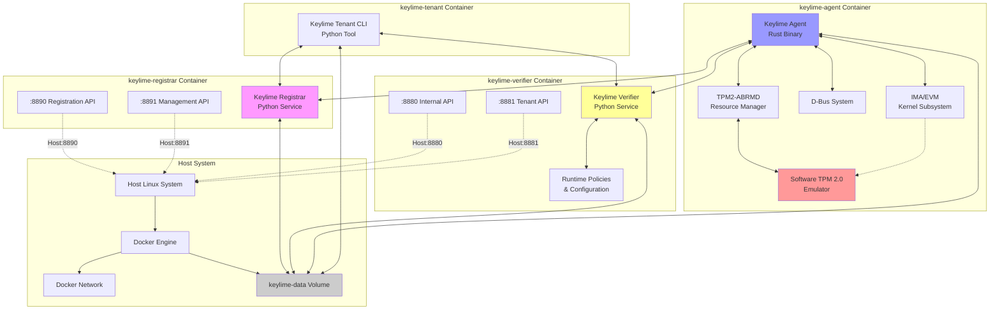

## Component Roles and Responsibilities (Docker Deployment)

### Software TPM (swtpm)
- **Primary Role**: Emulated Hardware Root of Trust
- **Key Functions**:
  - Emulates TPM 2.0 functionality in software
  - Stores cryptographic keys (EK, AK, DevID keys)
  - Generates attestation quotes
  - Maintains Platform Configuration Registers (PCRs)
  - Provides secure key storage and cryptographic operations
- **Configuration**: 
  - State directory: `/tmp/tpmdir` (ephemeral)
  - TCP ports: 2321 (data), 2322 (control)
  - Started with `swtpm_setup --tpm2 --createek --create-platform-cert`

### TPM2-ABRMD (TPM Resource Manager)
- **Primary Role**: TPM access broker and resource manager
- **Key Functions**:
  - Manages concurrent TPM access between processes
  - Handles TPM context management
  - Provides TCTI interface to applications
  - Manages TPM sessions and handles
- **Configuration**:
  - TCTI: `tabrmd:bus_type=system`
  - Connects to swtpm via `--tcti=swtpm:`
  - Runs with `--allow-root --flush-all`

### Keylime Agent Container (keylime-agent)
- **Primary Role**: Containerized trusted endpoint
- **Key Functions**:
  - Runs Rust-based keylime agent (`/usr/bin/keylime_agent`)
  - Communicates with software TPM via ABRMD
  - Registers with registrar container
  - Responds to verifier attestation requests
  - Manages secure payload decryption (if enabled)
  - Handles revocation notifications
- **Configuration**:
  - Privileged container with root access
  - Debug logging: `RUST_LOG=keylime_agent=debug,keylime=debug`
  - Secure mount disabled: `RUST_KEYLIME_SKIP_SECURE_MOUNT=1`
  - Registrar discovery: DNS lookup for 'registrar' container

### Keylime Registrar Container (keylime-registrar)
- **Primary Role**: Containerized agent enrollment service
- **Key Functions**:
  - Agent registration and EK/AK validation
  - TPM credential activation challenges
  - Agent identity verification
  - Database of registered agents
- **Network Configuration**:
  - Internal ports: 8890 (registration), 8891 (management)
  - Host ports: 8890:8890, 8891:8891
  - Container name: `keylime-registrar`
  - Environment: `KEYLIME_REGISTRAR_IP=0.0.0.0`

### Keylime Verifier Container (keylime-verifier)
- **Primary Role**: Containerized attestation verification service
- **Key Functions**:
  - Continuous agent monitoring
  - Quote validation and policy checking
  - IMA runtime measurement verification
  - Revocation notification generation
  - Secure payload key management
- **Network Configuration**:
  - Internal ports: 8880 (internal), 8881 (tenant API)
  - Host ports: 8880:8880, 8881:8881
  - Container name: `keylime-verifier`
  - Environment: `KEYLIME_VERIFIER_IP=0.0.0.0`

### Keylime Tenant Container (keylime-tenant)
- **Primary Role**: Management and policy interface
- **Key Functions**:
  - Command-line interface for agent management
  - Policy configuration and deployment
  - Agent enrollment and monitoring
  - Payload provisioning (when enabled)
- **Configuration**:
  - Runs on-demand (not continuously)
  - Accesses other containers via Docker network
  - Shares keylime-data volume for persistence

### IMA (Integrity Measurement Architecture)
- **Primary Role**: Runtime file integrity monitoring within agent container
- **Key Functions**:
  - Measures executed files and loaded modules
  - Extends measurements into TPM PCR 10
  - Provides measurement logs for verification
  - Supports file signature verification
- **Container Context**: Runs within agent container's kernel namespace

## Startup and Registration Workflow (Docker Deployment)

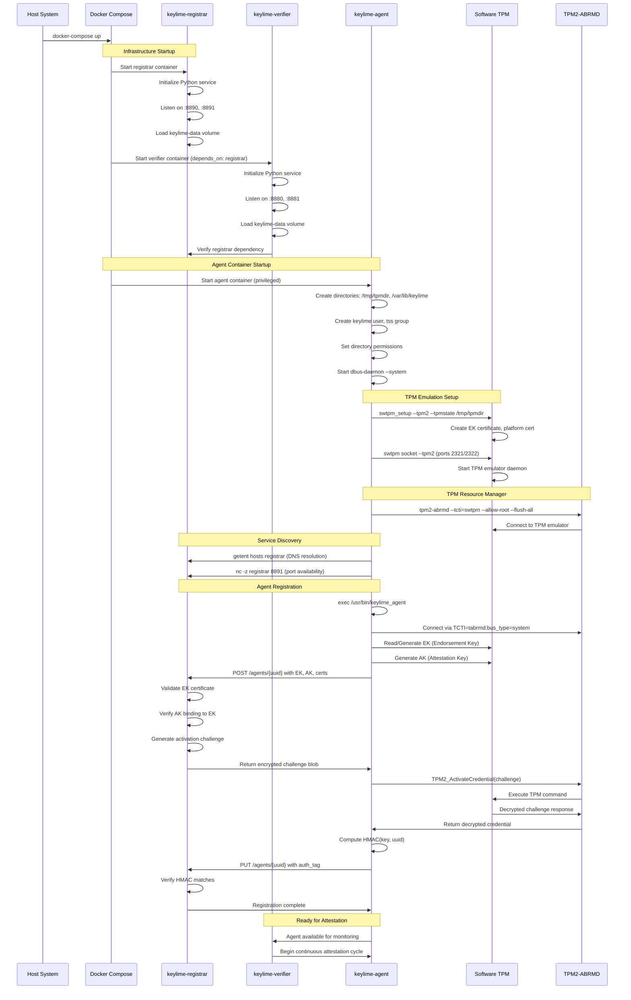

## Detailed Registration Process

### Phase 1: TPM Key Generation
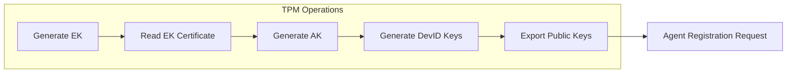

### Phase 2: Registrar Validation
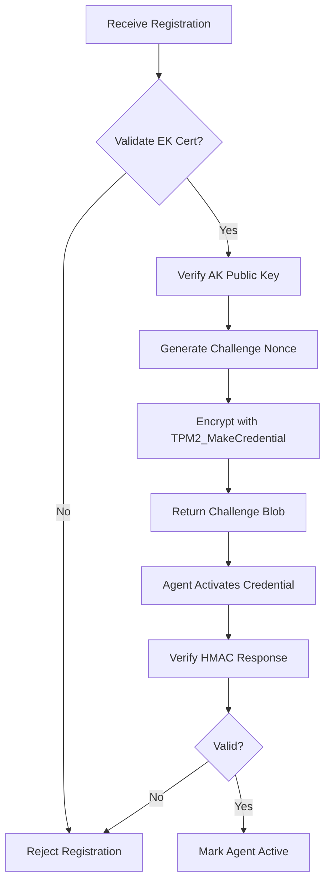

## Attestation Cycle (Docker Deployment)

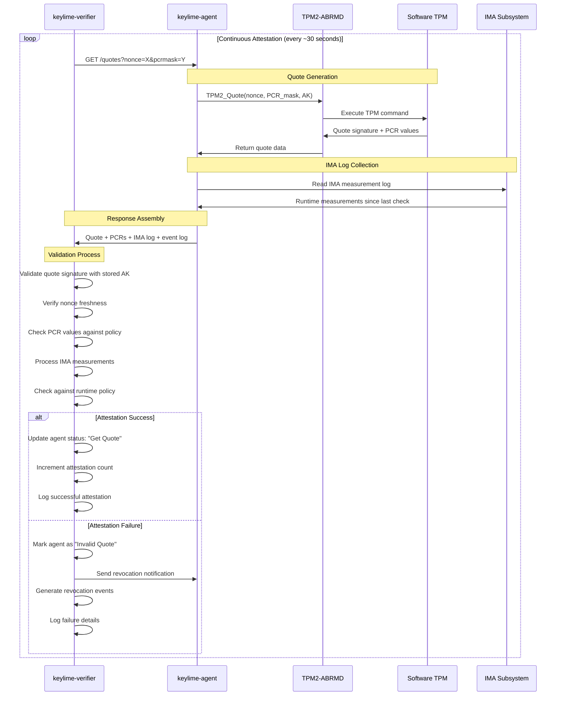

## Quote Validation Process

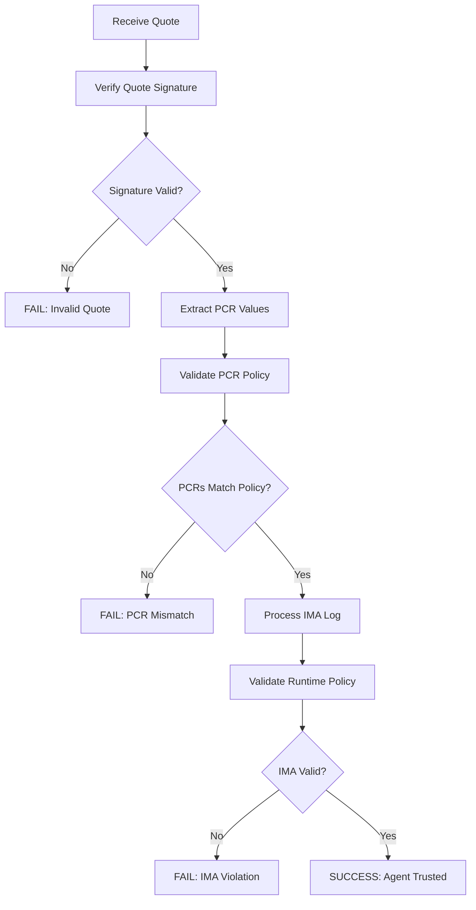

## Secure Payload Provisioning

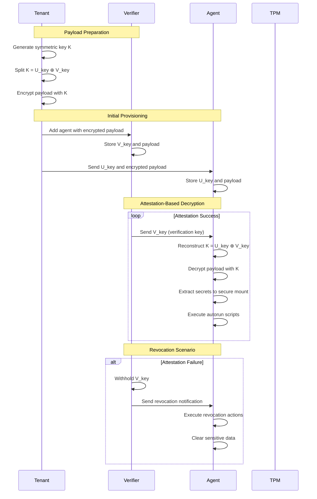

## Policy Enforcement Architecture

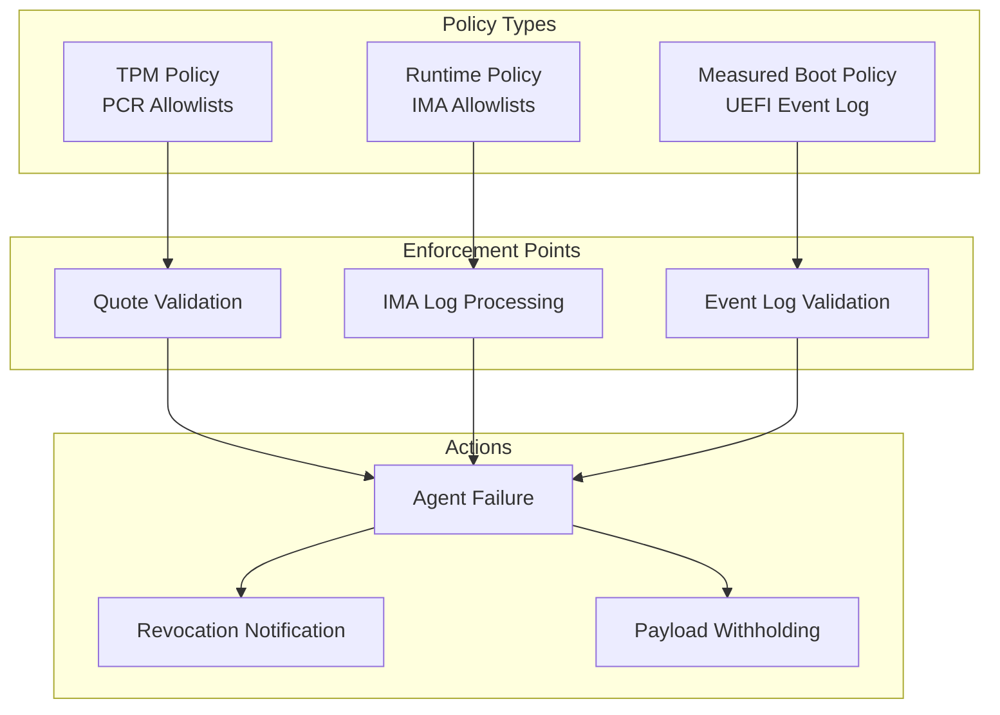

## IMA Runtime Monitoring

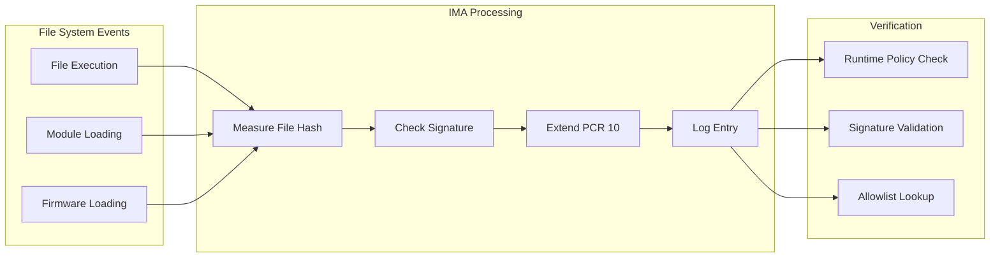

## Certificate and Key Management

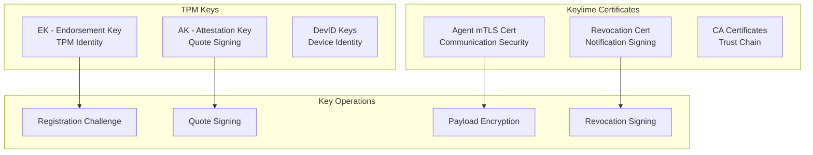

## Network Communication Flows (Docker Deployment)

```mermaid
graph TB
    subgraph "Host Network Interface"
        HOST_8890[Host:8890\nRegistrar API]
        HOST_8891[Host:8891\nRegistrar Mgmt]
        HOST_8880[Host:8880\nVerifier Internal]
        HOST_8881[Host:8881\nVerifier Tenant]
    end
    
    subgraph "Docker Network (keylime-network)"
        subgraph "keylime-registrar"
            REG_8890[":8890 Registration API"]
            REG_8891[":8891 Management API"]
        end
        
        subgraph "keylime-verifier"
            VER_8880[":8880 Internal API"]
            VER_8881[":8881 Tenant API"]
        end
        
        subgraph "keylime-agent"
            AGENT_9002[":9002 HTTPS (default)"]
            AGENT_TPM[TPM Stack\nswtpm + abrmd"]
        end
        
        subgraph "keylime-tenant"
            TENANT_CLI[Tenant CLI\nOn-demand]
        end
    end
    
    subgraph "Shared Storage"
        VOLUME[keylime-data Volume\n/var/lib/keylime]
    end
    
    %% Host port mappings
    HOST_8890 --> REG_8890
    HOST_8891 --> REG_8891
    HOST_8880 --> VER_8880
    HOST_8881 --> VER_8881
    
    %% Inter-container communication
    AGENT_9002 <--> VER_8880
    AGENT_9002 <--> REG_8890
    TENANT_CLI <--> VER_8881
    TENANT_CLI <--> REG_8891
    
    %% Shared storage access
    REG_8890 <--> VOLUME
    VER_8880 <--> VOLUME
    AGENT_9002 <--> VOLUME
    TENANT_CLI <--> VOLUME
    
    %% TPM access within agent
    AGENT_9002 <--> AGENT_TPM
    
    style HOST_8890 fill:#e1f5fe
    style HOST_8891 fill:#e1f5fe
    style HOST_8880 fill:#e1f5fe
    style HOST_8881 fill:#e1f5fe
    style VOLUME fill:#f3e5f5
```

## Attack Surface Analysis (Docker Deployment)

### 1. Container-Specific Attack Vectors

```mermaid
graph TB
    subgraph "Container Breakout Threats"
        A[Privileged Container Escape]
        B[Volume Mount Exploitation]
        C[Network Namespace Bypass]
        D[Process Injection]
    end
    
    subgraph "Software TPM Threats"
        E[TPM Emulation Bypass]
        F[State Directory Manipulation]
        G[ABRMD Resource Manager Attacks]
        H[D-Bus Interface Exploitation]
    end
    
    subgraph "Inter-Container Communication"
        I[Container Name Spoofing]
        J[Docker Network MITM]
        K[Volume Race Conditions]
        L[Service Discovery Poisoning]
    end
    
    subgraph "Mitigations"
        M[Container Security Policies]
        N[Volume Permission Controls]
        O[Network Segmentation]
        P[Process Monitoring]
    end
    
    A -.-> M
    B -.-> N
    C -.-> O
    D -.-> P
    E -.-> M
    F -.-> N
    G -.-> P
    H -.-> O
    I -.-> O
    J -.-> O
    K -.-> N
    L -.-> P
```

### 2. Docker-Specific TPM Attack Vectors

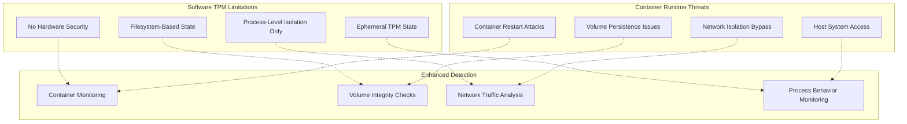

### 3. Container Network Attack Vectors

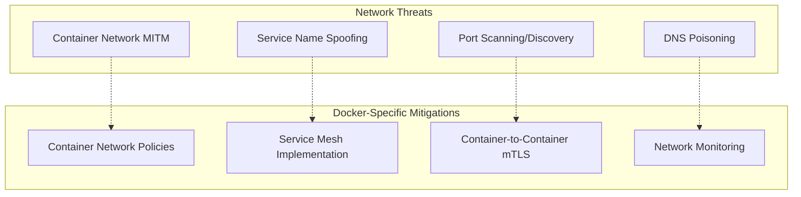

## Potential Vulnerability Areas (Docker Deployment)

### High-Risk Components:
1. **Container-to-Container Communication**
   - Service name spoofing attacks
   - Docker network MITM vulnerabilities
   - Container escape to host system
   - Volume mount exploitation

2. **Software TPM Implementation**
   - TPM emulation bypass techniques
   - Filesystem-based state manipulation
   - ABRMD resource manager vulnerabilities
   - D-Bus interface exploitation

3. **Agent Container Security**
   - Privileged container escape
   - Process injection into agent
   - Configuration file tampering
   - Debug log information leakage

4. **Shared Volume Security**
   - Race conditions in keylime-data volume
   - Cross-container data access
   - Permission escalation via shared files
   - Persistent state corruption

### Medium-Risk Areas:
1. **Docker Network Security**
   - Network namespace bypass
   - Container network discovery
   - Inter-container traffic analysis
   - Service discovery poisoning

2. **Container Runtime Security**
   - Container restart timing attacks
   - Environment variable exposure
   - Resource exhaustion attacks
   - Container image supply chain

### Docker-Specific Testing Recommendations:
1. **Container Security Testing**
   - Test container escape scenarios
   - Verify volume mount security
   - Check network isolation effectiveness
   - Validate process isolation boundaries

2. **Software TPM Testing**
   - Test TPM emulation bypass techniques
   - Verify state persistence security
   - Check ABRMD resource management
   - Test D-Bus interface security

3. **Inter-Container Communication Testing**
   - Test service name spoofing
   - Verify network traffic encryption
   - Check container-to-container authentication
   - Test shared volume access controls

4. **Configuration Security Testing**
   - Test configuration file injection
   - Verify environment variable security
   - Check secrets management
   - Test debug mode information leakage

### Docker Deployment Security Considerations:
1. **Use non-privileged containers** when possible
2. **Implement network policies** for container communication
3. **Use secrets management** for sensitive configuration
4. **Monitor container runtime** for anomalous behavior
5. **Implement container image scanning** for vulnerabilities
6. **Use read-only filesystems** where applicable
7. **Implement proper logging and monitoring** for container activities
