# Keylime Architecture and Workflow Analysis

## Table of Contents
1. [Overall System Architecture](#overall-system-architecture)
2. [Component Interaction Diagrams](#component-interaction-diagrams)
3. [Startup and Registration Workflow](#startup-and-registration-workflow)
4. [Attestation Cycle](#attestation-cycle)
5. [Secure Payload Provisioning](#secure-payload-provisioning)
6. [Policy Enforcement and Revocation](#policy-enforcement-and-revocation)
7. [Attack Surface Analysis](#attack-surface-analysis)

## Overall System Architecture

```mermaid
graph TB
    subgraph "Trust Domain"
        TPM[TPM 2.0<br/>Hardware Security Module]
        IMA[IMA/EVM<br/>Kernel Subsystem]
        Agent[Keylime Agent<br/>(Rust)]
    end
    
    subgraph "Infrastructure"
        Registrar[Keylime Registrar<br/>(Python)]
        Verifier[Keylime Verifier<br/>(Python)]
        CA[Certificate Authority<br/>& Key Management]
    end
    
    subgraph "Management"
        Tenant[Keylime Tenant CLI<br/>(Python)]
        Policy[Runtime Policies<br/>& Configuration]
    end
    
    subgraph "Boot Chain"
        UEFI[UEFI Firmware]
        SecureBoot[Secure Boot]
        Bootloader[GRUB2 Bootloader]
        Kernel[Linux Kernel]
        InitRamFS[InitramFS]
    end
    
    %% Core Relationships
    Agent <--> TPM
    Agent <--> IMA
    Agent <--> Registrar
    Agent <--> Verifier
    Tenant <--> Verifier
    Tenant <--> Registrar
    Verifier <--> Policy
    
    %% Boot Chain Flow
    UEFI --> SecureBoot
    SecureBoot --> Bootloader
    Bootloader --> Kernel
    Kernel --> InitRamFS
    InitRamFS --> Agent
    
    %% Measurement Chain
    UEFI -.-> TPM
    SecureBoot -.-> TPM
    Bootloader -.-> TPM
    Kernel -.-> TPM
    InitRamFS -.-> TPM
    IMA -.-> TPM
    
    style TPM fill:#ff9999
    style IMA fill:#99ff99
    style Agent fill:#9999ff
    style Verifier fill:#ffff99
    style Registrar fill:#ff99ff
```

## Component Roles and Responsibilities

### TPM (Trusted Platform Module)
- **Primary Role**: Hardware Root of Trust
- **Key Functions**:
  - Stores cryptographic keys (EK, AK, DevID keys)
  - Generates attestation quotes
  - Maintains Platform Configuration Registers (PCRs)
  - Provides secure key storage and cryptographic operations
- **Security Properties**: Tamper-resistant, authenticated boot measurements

### Keylime Agent (Rust Implementation)
- **Primary Role**: Trusted endpoint being attested
- **Key Functions**:
  - Communicates with TPM for quotes and measurements
  - Registers with Registrar
  - Responds to Verifier attestation requests
  - Manages secure payload decryption
  - Handles revocation notifications
- **Ports**: 9002 (HTTPS), optionally ZMQ for notifications

### Keylime Registrar (Python)
- **Primary Role**: Agent enrollment and identity management
- **Key Functions**:
  - Agent registration and EK/AK validation
  - TPM credential activation challenges
  - Agent identity verification
  - Database of registered agents
- **Ports**: 8890 (HTTPS), 8891 (HTTP)

### Keylime Verifier (Python)
- **Primary Role**: Continuous attestation and policy enforcement
- **Key Functions**:
  - Continuous agent monitoring
  - Quote validation and policy checking
  - IMA runtime measurement verification
  - Revocation notification generation
  - Secure payload key management
- **Ports**: 8881 (HTTPS)

### IMA (Integrity Measurement Architecture)
- **Primary Role**: Runtime file integrity monitoring
- **Key Functions**:
  - Measures executed files and loaded modules
  - Extends measurements into PCR 10
  - Provides measurement logs for verification
  - Supports file signature verification

## Startup and Registration Workflow

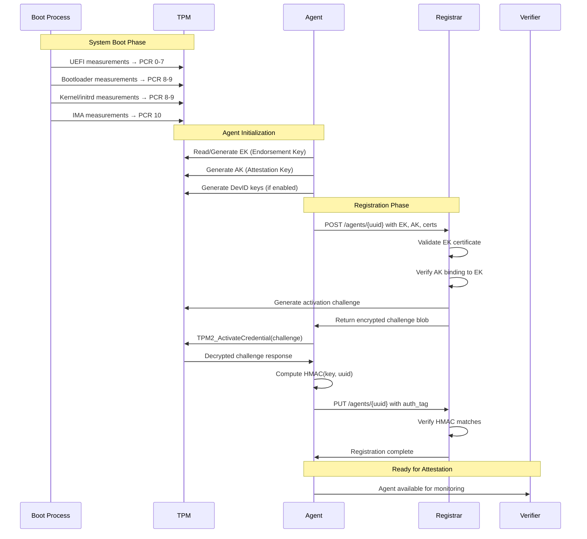

## Detailed Registration Process

### Phase 1: TPM Key Generation
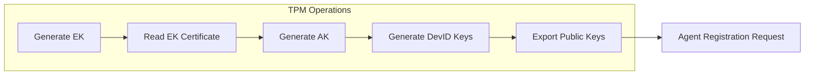

### Phase 2: Registrar Validation
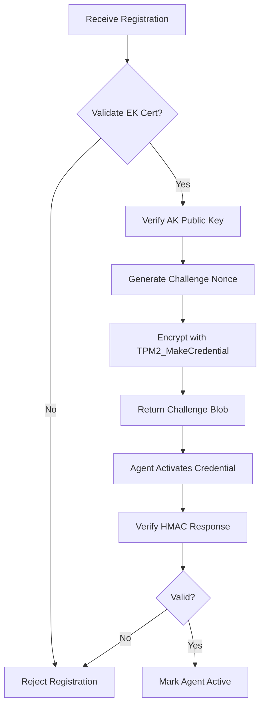

## Attestation Cycle

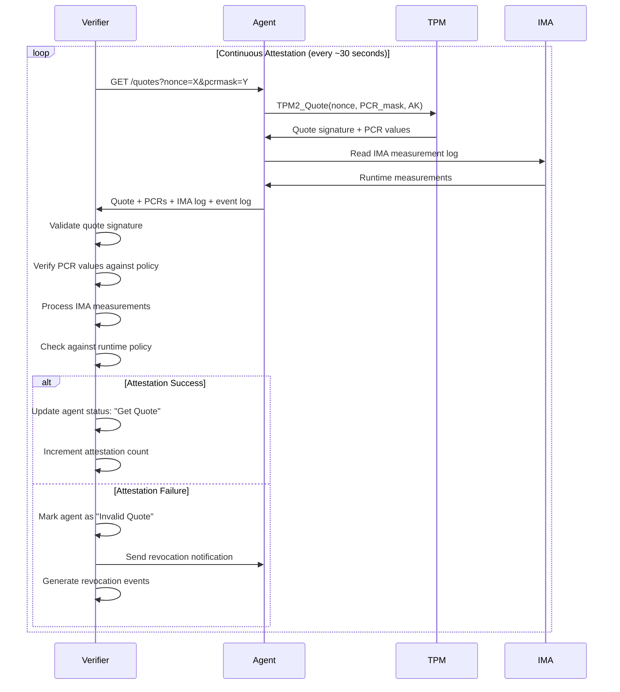

## Quote Validation Process

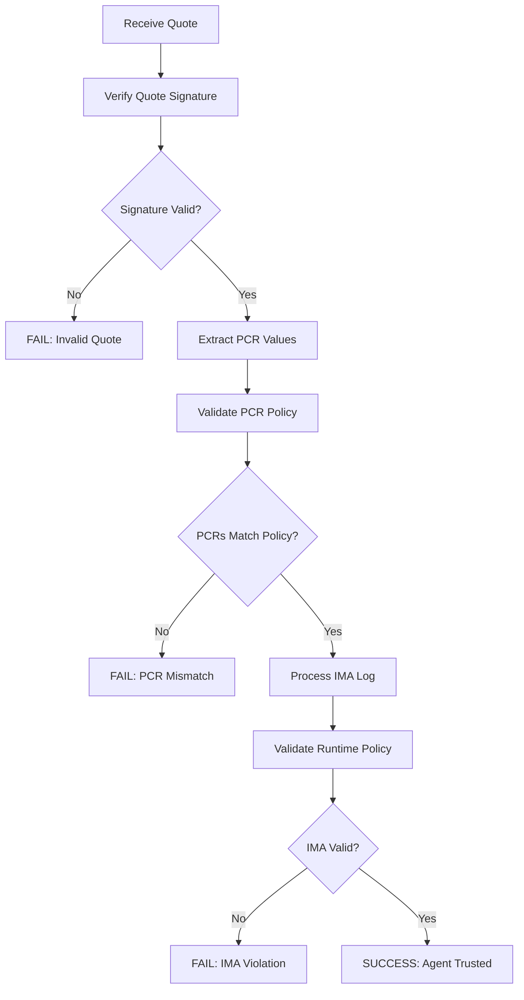

## Secure Payload Provisioning

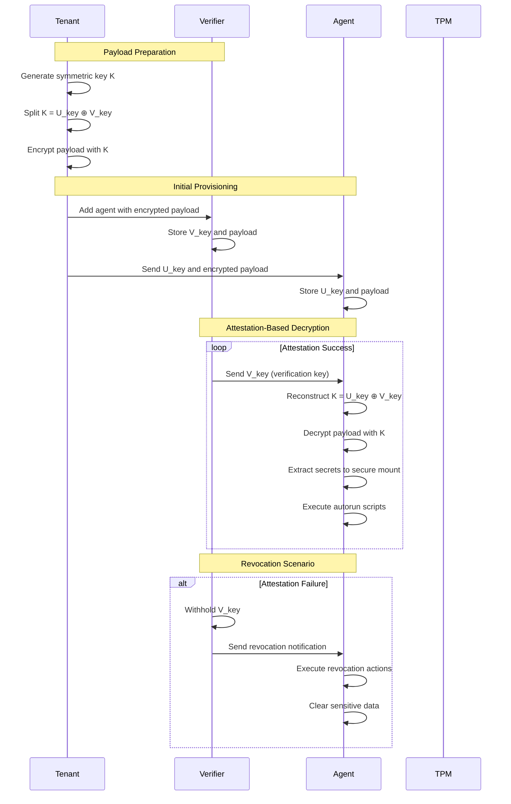

## Policy Enforcement Architecture

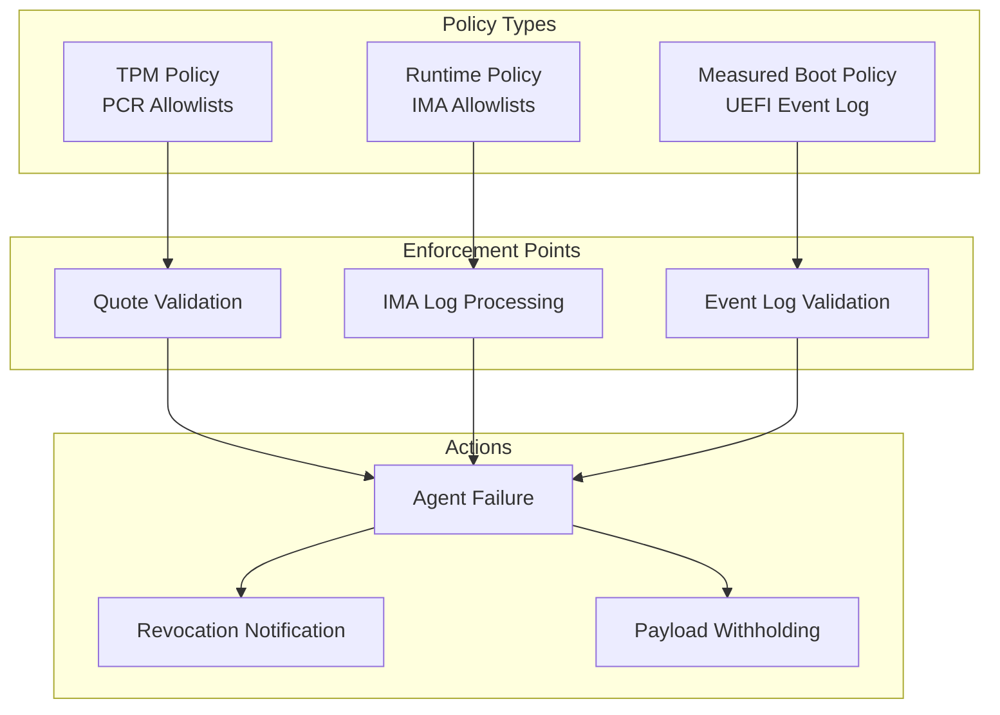

## IMA Runtime Monitoring

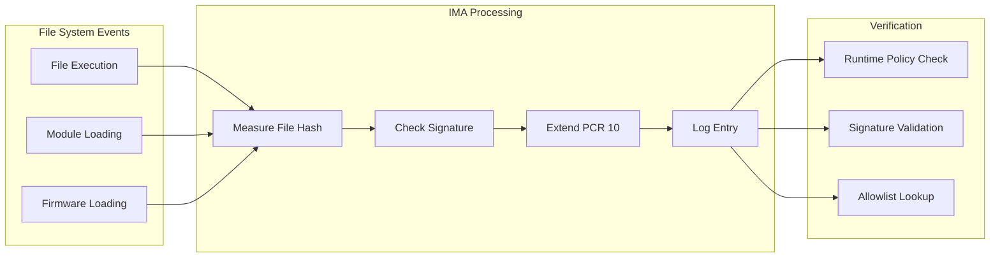

## Certificate and Key Management

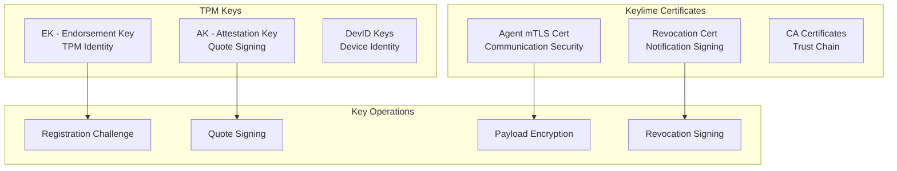

## Network Communication Flows

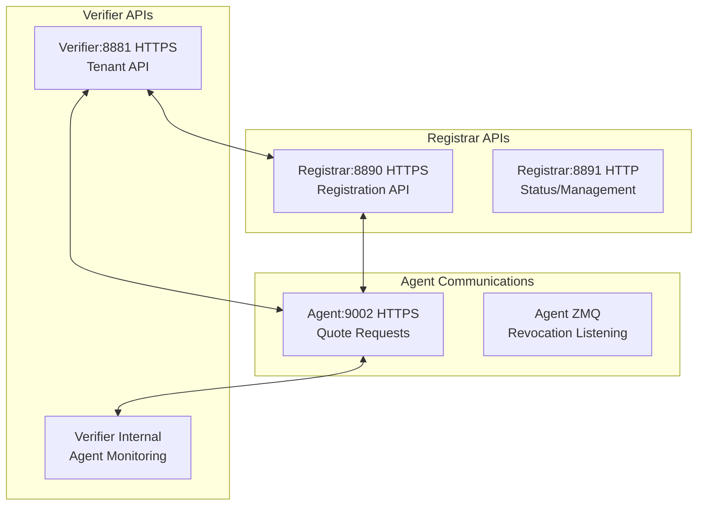

## Attack Surface Analysis

### 1. Network Attack Vectors

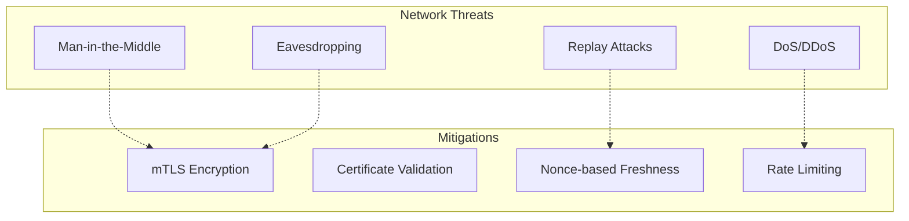

### 2. TPM Attack Vectors

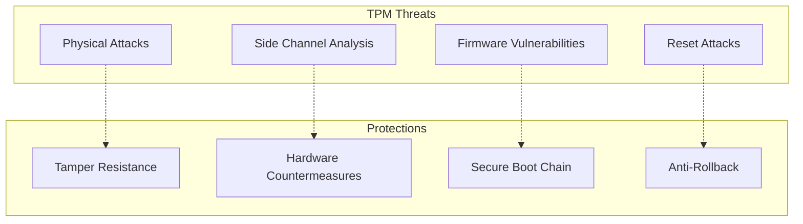

### 3. Software Attack Vectors

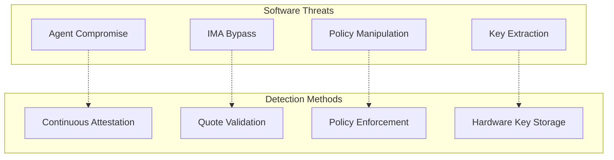

## Potential Vulnerability Areas

### High-Risk Components:
1. **Agent-Verifier Communication**
   - Quote replay attacks
   - Network protocol vulnerabilities
   - Certificate validation bypasses

2. **TPM Integration**
   - TPM firmware vulnerabilities
   - Key extraction attacks
   - Reset/rollback attacks

3. **Policy Enforcement**
   - IMA bypass techniques
   - Runtime policy manipulation
   - Measurement log tampering

4. **Registrar Security**
   - Registration flooding
   - Identity spoofing
   - Challenge response manipulation

### Medium-Risk Areas:
1. **Secure Payload Handling**
   - Key reconstruction timing
   - Memory-resident key exposure
   - Payload decryption side-channels

2. **Revocation Mechanisms**
   - Revocation notification delivery
   - Action execution reliability
   - Certificate revocation timing

### Testing Recommendations:
1. **Fuzzing Network Protocols**: Test all REST API endpoints
2. **TPM Stress Testing**: Verify behavior under unusual TPM states
3. **IMA Bypass Research**: Test various kernel-level bypass techniques
4. **Timing Analysis**: Look for side-channel vulnerabilities
5. **Policy Manipulation**: Test robustness of policy parsing and enforcement

This analysis provides a comprehensive foundation for understanding Keylime's architecture and identifying potential security research areas for your thesis.
