# Keylime Attack Vector Visualization

## Attack Tree Analysis


## Attack Impact Analysis

### Critical Attack Paths

#### Path 1: Agent Compromise → System Control


#### Path 2: Infrastructure Compromise → Mass Evasion


#### Path 3: Boot Chain Attack → Persistent Compromise


## Vulnerability Severity Matrix

| **Component** | **Attack Vector** | **Severity** | **Likelihood** | **Detection** |
|---------------|------------------|--------------|----------------|----------------|
| Agent API | Buffer Overflow | High | Medium | Low |
| Registrar DB | SQL Injection | High | High | Medium |
| Verifier | Policy Bypass | Critical | Low | High |
| TPM | Physical Attack | Critical | Low | Low |
| TLS | Downgrade | Medium | Medium | High |
| IMA | Policy Evasion | High | Medium | Medium |

## Attack Surface Heat Map

```mermaid
graph TB
    subgraph "Attack Surface Analysis"
        direction TB
        
        subgraph "Network Layer"
            N1[REST APIs<br/>🔴 HIGH RISK]
            N2[TLS Transport<br/>🟡 MEDIUM RISK]
            N3[Certificate Management<br/>🟡 MEDIUM RISK]
        end
        
        subgraph "Application Layer"
            A1[Agent Process<br/>🔴 HIGH RISK]
            A2[Registrar Service<br/>🔴 HIGH RISK]
            A3[Verifier Engine<br/>🟠 CRITICAL RISK]
        end
        
        subgraph "System Layer"
            S1[TPM Hardware<br/>🟠 CRITICAL RISK]
            S2[IMA Subsystem<br/>🟡 MEDIUM RISK]
            S3[Boot Chain<br/>🟠 CRITICAL RISK]
        end
        
        subgraph "Data Layer"
            D1[Agent Registry<br/>🔴 HIGH RISK]
            D2[Policy Database<br/>🔴 HIGH RISK]
            D3[Secure Storage<br/>🟡 MEDIUM RISK]
        end
    end
```



## Research Methodology Framework

### 1. Static Analysis Targets
```python
# High-priority code paths for analysis
static_analysis_targets = {
    "agent": [
        "keylime-agent/src/main.rs",           # Main service loop
        "keylime-agent/src/tpm.rs",            # TPM operations
        "keylime-agent/src/secure_mount.rs",   # Payload handling
        "keylime-agent/src/crypto.rs",         # Cryptographic operations
    ],
    "registrar": [
        "keylime/registrar.py",                # Agent registration
        "keylime/registrar_common.py",         # Database operations
        "keylime/crypto.py",                   # Crypto validation
    ],
    "verifier": [
        "keylime/verifier.py",                 # Main verification logic
        "keylime/ima.py",                      # IMA processing
        "keylime/tpm_util.py",                 # TPM utilities
    ]
}
```

### 2. Dynamic Analysis Strategy
```bash
# Fuzzing campaign structure
fuzz_campaigns = {
    "api_fuzzing": {
        "target": "REST API endpoints",
        "tools": ["ffuf", "wfuzz", "boofuzz"],
        "payloads": ["json_malformed", "oversized", "unicode"]
    },
    "protocol_fuzzing": {
        "target": "TLS/HTTP protocols",
        "tools": ["tlsfuzzer", "protocol_state_fuzzer"],
        "focus": ["certificate_validation", "handshake_fuzzing"]
    },
    "cryptographic_fuzzing": {
        "target": "Quote validation",
        "tools": ["custom_fuzzer"],
        "focus": ["pcr_manipulation", "nonce_replay"]
    }
}
```

### 3. Proof-of-Concept Development
```python
# PoC attack framework structure
poc_framework = {
    "quote_replay": {
        "description": "Replay old quotes to bypass freshness",
        "target": "Verifier quote validation",
        "technique": "Timestamp manipulation"
    },
    "policy_bypass": {
        "description": "Evade runtime policy enforcement",
        "target": "IMA policy evaluation",
        "technique": "Whitelist manipulation"
    },
    "registration_spoofing": {
        "description": "Register malicious agents",
        "target": "Registrar validation",
        "technique": "Certificate forging"
    }
}
```

## Detection and Monitoring Strategy

### 1. Anomaly Detection Points
```yaml
monitoring_points:
  network_layer:
    - abnormal_api_request_patterns
    - tls_handshake_anomalies
    - certificate_validation_failures
    
  application_layer:
    - quote_generation_failures
    - policy_violation_spikes
    - registration_attempt_floods
    
  system_layer:
    - pcr_measurement_discrepancies
    - ima_policy_violations
    - tpm_communication_errors
```

### 2. SIEM Integration Templates
```json
{
  "keylime_security_events": {
    "high_severity": [
      "quote_validation_failed",
      "agent_registration_anomaly",
      "policy_violation_detected"
    ],
    "medium_severity": [
      "tls_handshake_failure",
      "certificate_validation_warning",
      "ima_measurement_mismatch"
    ],
    "low_severity": [
      "configuration_change",
      "service_restart",
      "debug_mode_enabled"
    ]
  }
}
```

## Vulnerability Disclosure Framework

### 1. Responsible Disclosure Process


### 2. Severity Classification
```python
severity_matrix = {
    "critical": {
        "impact": "Complete system compromise",
        "exploitability": "Remote, unauthenticated",
        "examples": ["RCE in agent", "TPM key extraction"]
    },
    "high": {
        "impact": "Significant security bypass",
        "exploitability": "Remote, authenticated",
        "examples": ["Policy bypass", "Quote replay"]
    },
    "medium": {
        "impact": "Information disclosure",
        "exploitability": "Local access required",
        "examples": ["Memory leaks", "Timing attacks"]
    },
    "low": {
        "impact": "Minor information leak",
        "exploitability": "Complex exploitation",
        "examples": ["Debug info", "Error messages"]
    }
}
```

---

*This attack vector visualization provides a structured approach to vulnerability research in Keylime, supporting systematic security analysis and thesis development.*
