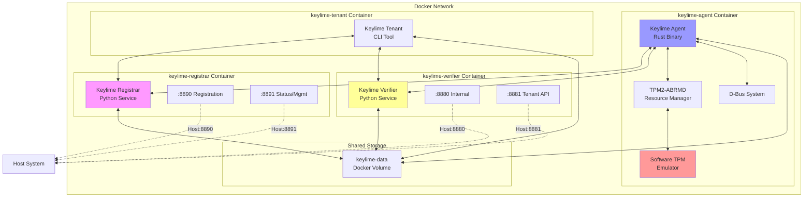
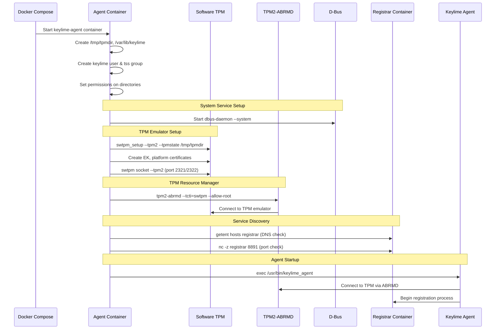
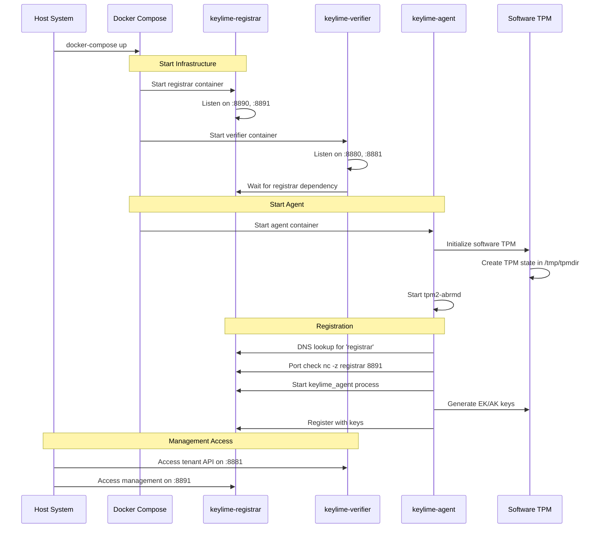

# Keylime Docker Deployment Architecture - Based on Your Configuration

## Docker Compose Setup

Based on `docker-compose.yml` files, here's the **actual** deployment architecture:

## Agent Container Startup Sequence

## Corrected Component Communication

### Network Configuration
- **Container Names**: `keylime-registrar`, `keylime-verifier`, `keylime-agent`, `keylime-tenant`
- **Internal Communication**: Containers communicate via container names
- **Host Access**: Only registrar and verifier expose ports to host

### TPM Configuration
- **Software TPM**: Uses `swtpm` emulator, not hardware TPM
- **TPM Resource Manager**: Uses `tpm2-abrmd` for TPM access
- **TPM State**: Stored in `/tmp/tpmdir` (ephemeral)

### Agent Configuration
- **Rust Implementation**: Uses `/usr/bin/keylime_agent` (Rust binary)
- **Debug Mode**: `RUST_LOG=keylime_agent=debug,keylime=debug`
- **Secure Mount**: Disabled with `RUST_KEYLIME_SKIP_SECURE_MOUNT=1`

## Updated Sequence Diagram Based on Your Setup

