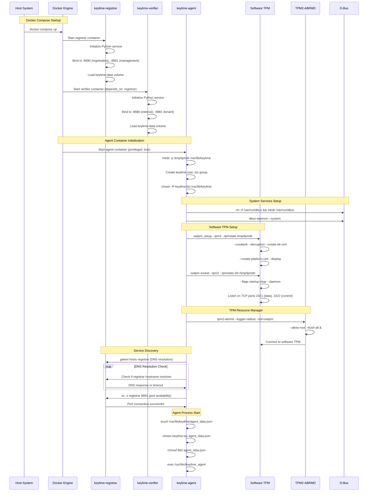
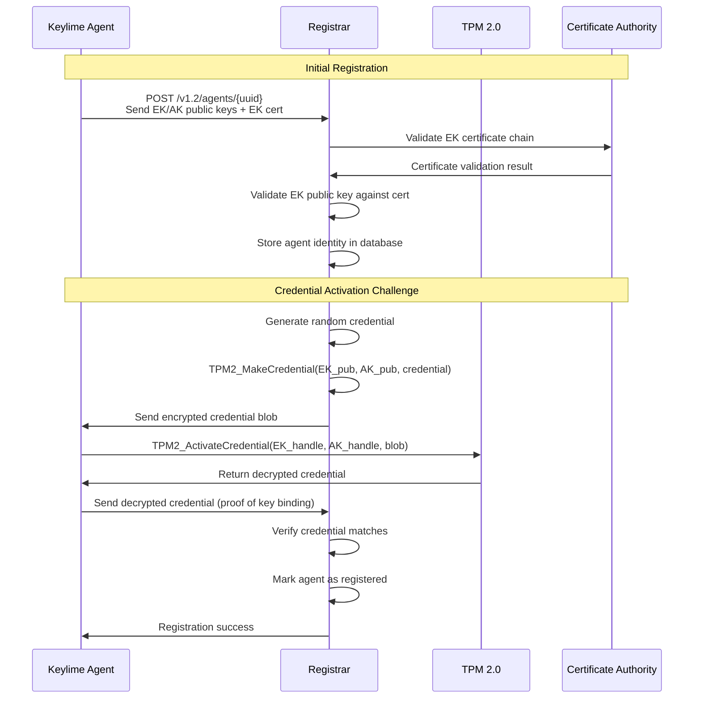
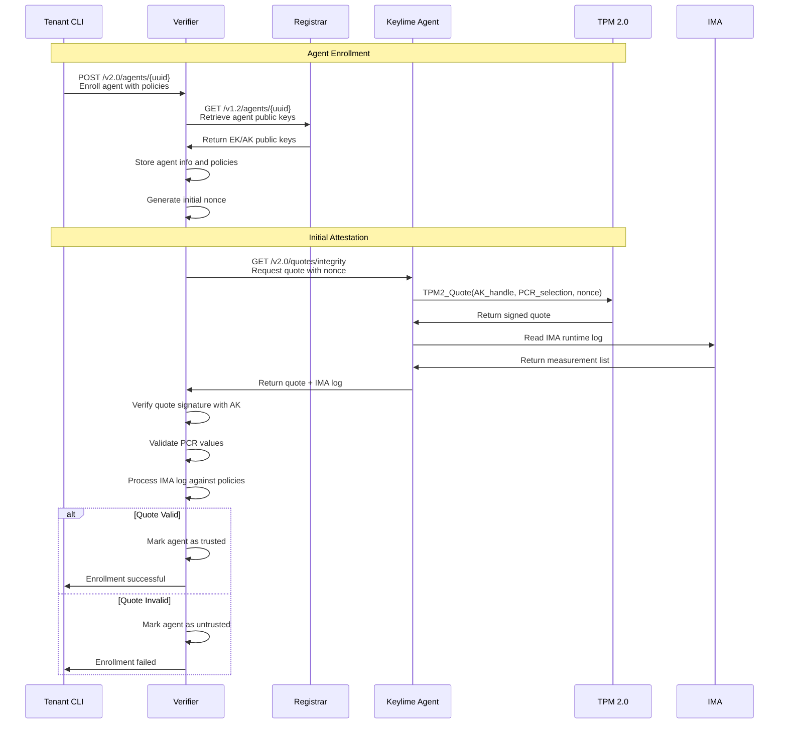
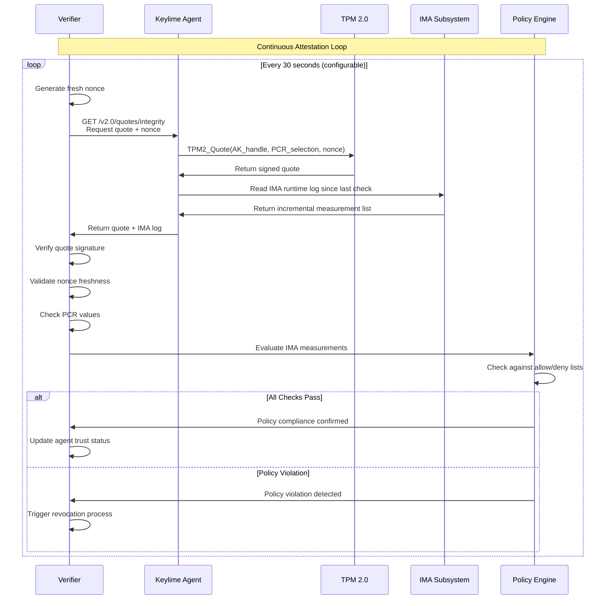
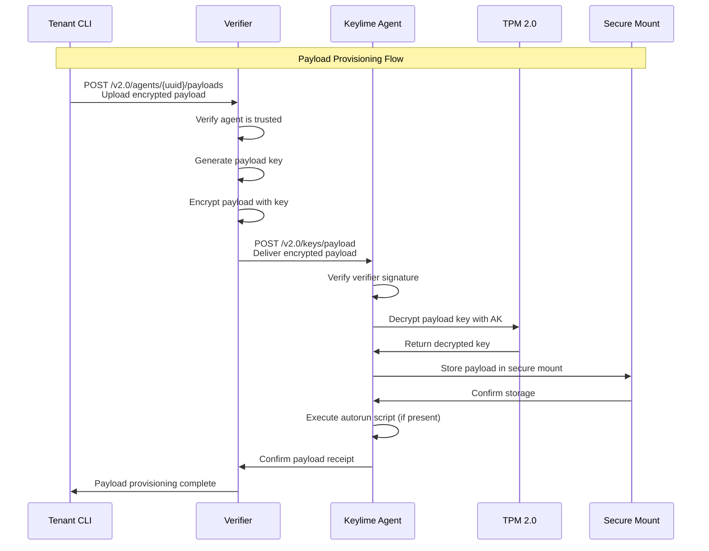
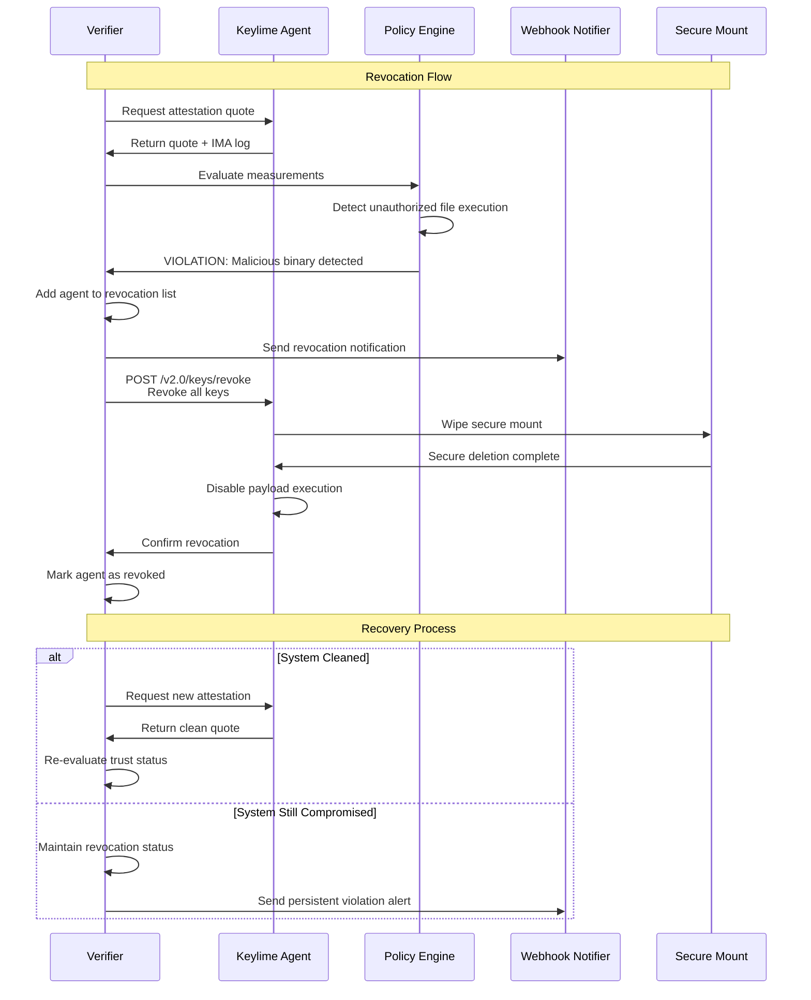
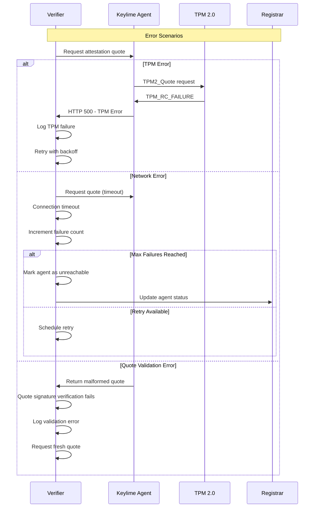
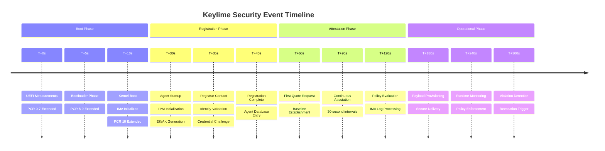

# Keylime Complete Sequence Diagrams

## End-to-End System Flow

This document provides comprehensive sequence diagrams showing every step of Keylime's operation from boot to operational attestation.

## Phase 1: Docker Container Boot and Initialization



## Phase 2: Agent Registration Process



## Phase 3: Verifier Setup and Agent Enrollment



## Phase 4: Ongoing Attestation Cycle



## Phase 5: Secure Payload Provisioning



## Phase 6: Policy Violation and Revocation



## Phase 7: Error Handling and Recovery



## Security Event Timeline



## Message Format Reference

### Quote Request/Response
```json
{
  "request": {
    "nonce": "base64_encoded_random_bytes",
    "pcrmask": "0x408001",
    "ima_ml_entry": 0
  },
  "response": {
    "quote": "base64_encoded_tpm_quote",
    "ima_measurement_list": "base64_encoded_ima_log",
    "boottime": "2024-01-15T10:30:00Z"
  }
}
```

### Registration Data
```json
{
  "ek_tpm": "base64_encoded_ek_public_key",
  "aik_tpm": "base64_encoded_ak_public_key",
  "ekcert": "PEM_encoded_ek_certificate",
  "mtls_cert": "PEM_encoded_mtls_certificate",
  "ip": "192.168.1.100",
  "port": 9002
}
```

### Policy Violation Event
```json
{
  "agent_id": "uuid-12345",
  "timestamp": "2024-01-15T10:30:45Z",
  "violation_type": "ima_policy_violation",
  "details": {
    "file_path": "/bin/malicious_binary",
    "ima_signature": "invalid",
    "policy_action": "deny"
  },
  "severity": "high"
}
```

---