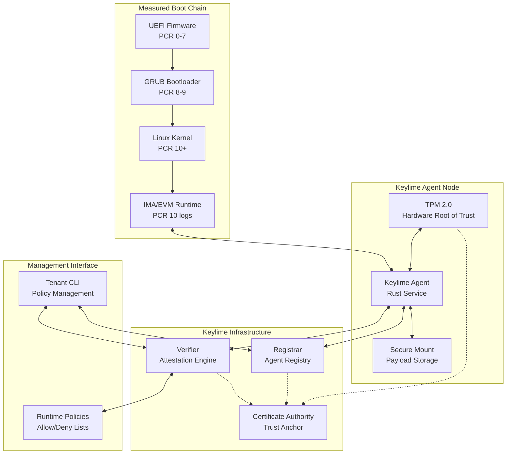
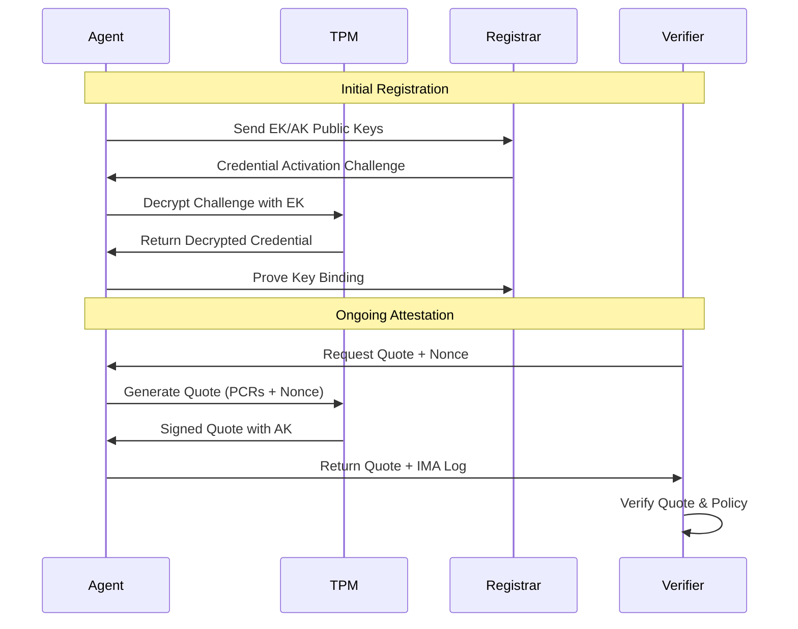
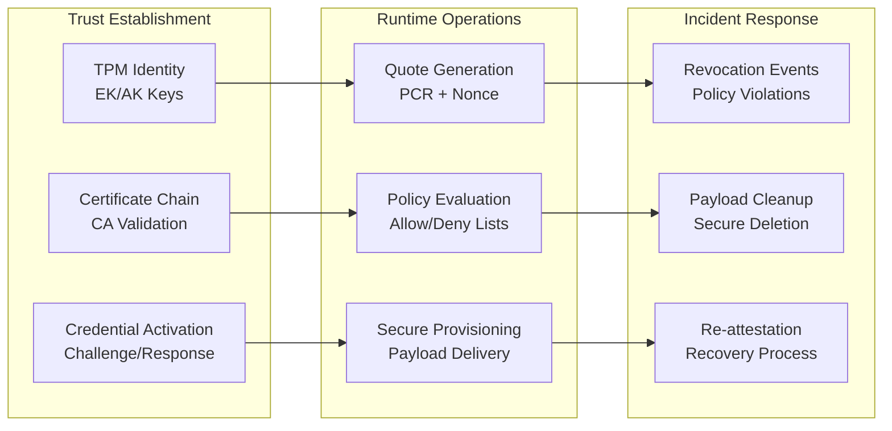

# Keylime Visual Architecture Summary

## Quick Reference Guide

This document provides a high-level visual summary of Keylime's architecture and workflows, complementing the detailed documentation in the other files.

## Core Architecture Overview



## Key Security Properties

### 1. Hardware Root of Trust
- **TPM 2.0**: Provides cryptographic identity and secure measurement storage
- **Measured Boot**: Creates tamper-evident boot log in PCR registers
- **Remote Attestation**: Enables cryptographic proof of system state

### 2. Cryptographic Attestation Flow


### 3. Threat Model Coverage

| **Attack Vector** | **Protection Mechanism** | **Limitations** |
|-------------------|-------------------------|------------------|
| Boot-time Tampering | Measured Boot + PCR Verification | Depends on Secure Boot |
| Runtime File Modification | IMA Measurements + Policy | Policy Completeness |
| Network MITM | mTLS + Certificate Validation | Certificate Management |
| TPM Attacks | Hardware Security Module | Physical Access |
| Agent Compromise | Secure Mount + Revocation | Agent Process Security |

## Component Interaction Matrix



## Attack Surface Quick Reference

### High-Priority Targets
1. **Agent REST API** (Port 9002) - Quote manipulation, payload injection
2. **Registrar Database** - Agent identity spoofing, SQL injection
3. **Verifier Policy Engine** - Policy bypass, logic flaws
4. **TPM Communication** - Quote replay, measurement manipulation

### Common Vulnerability Patterns
- **Input Validation**: Malformed JSON, oversized payloads
- **Authentication**: JWT manipulation, certificate bypass
- **Cryptographic**: Timing attacks, weak randomness
- **Logic**: Race conditions, state confusion

## Research Directions Summary

### 1. Protocol-Level Attacks
- **Quote Replay**: Timestamp validation bypasses
- **Nonce Manipulation**: Freshness guarantee violations
- **Certificate Attacks**: CA compromise, weak validation

### 2. Implementation Vulnerabilities
- **Memory Safety**: Buffer overflows in quote processing
- **Race Conditions**: Concurrent access to shared state
- **Error Handling**: Information leakage through exceptions

### 3. Architectural Weaknesses
- **Trust Assumptions**: CA compromise scenarios
- **Scalability**: Resource exhaustion attacks
- **Recovery**: Revocation and re-attestation flaws

## Deployment Considerations

### Secure Configuration
```yaml
# Example secure configuration
keylime:
  agent:
    secure_size: "1G"
    tpm_ownerpassword: "generated_password"
    trusted_payload_path: "/opt/keylime/secure_payloads"
    
  verifier:
    quote_interval: 30
    policy_dir: "/etc/keylime/policies"
    revocation_notifier: "webhook"
    
  registrar:
    database_url: "sqlite:///var/lib/keylime/cv_data.sqlite"
    auto_migrate_db: true
```

### Monitoring Points
- **Agent Health**: Quote generation success/failure
- **Network Traffic**: TLS handshake anomalies
- **TPM Status**: PCR measurement discrepancies
- **Policy Violations**: Real-time alert triggers

## Integration with Existing Security

### SIEM Integration
```python
# Example log format for SIEM
{
    "timestamp": "2024-01-15T10:30:45Z",
    "component": "keylime_verifier",
    "event": "quote_validation_failed",
    "agent_id": "uuid-12345",
    "pcr_mismatch": ["10"],
    "policy_violation": "unauthorized_file_execution",
    "severity": "high"
}
```

### Compliance Frameworks
- **NIST SP 800-155**: Measured Boot requirements
- **Common Criteria**: TPM evaluation standards
- **FIPS 140-2**: Cryptographic module validation

---