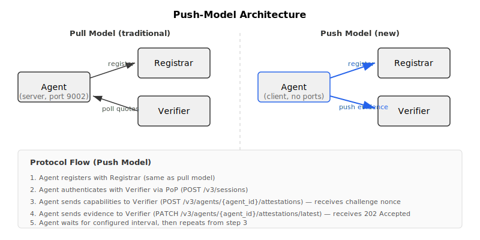
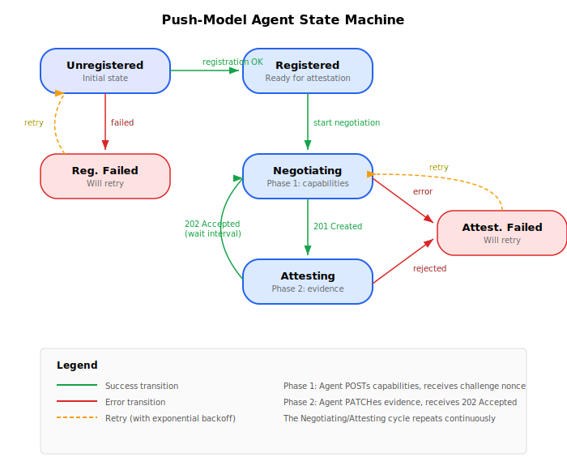

========================
Push-Model Attestation
========================

.. warning::
    Push-model attestation is currently experimental. The feature is functional
    but the API and configuration options may change in future releases.
    Please report issues at https://github.com/keylime/keylime/issues/?q=label:push-mode

Introduction
------------

Traditional Keylime attestation uses a **pull model** where the verifier continuously
polls agents for attestation data. The agent acts as a server and the verifier initiates
connections to it. This model requires that the verifier can reach the agent over the
network.

The **push model** reverses this communication direction: the agent initiates connections
to the verifier and proactively sends attestation data. The verifier never connects to
the agent. This makes push-model attestation suitable for environments where the
verifier cannot directly reach the agent, such as:

* **Edge and IoT devices** behind firewalls or NAT
* **Hybrid cloud environments** with restricted network policies
* **Air-gapped networks** where inbound connections to agents are not permitted
* **Dynamic environments** where agent IP addresses change frequently

In push mode, the agent is a separate binary (``keylime-push-model-agent``) that
implements the push attestation protocol using API version 3.0.

Architectural Overview
----------------------

In pull-model attestation, the verifier runs a polling loop that periodically contacts
each registered agent to request a TPM quote and associated evidence. The agent exposes
an HTTPS server that responds to these requests.

In push-model attestation, this relationship is inverted:

* The **agent initiates** all connections to the verifier
* The agent does **not expose any HTTP endpoints** (no listening ports)
* The verifier accepts incoming attestation data from agents
* Verification is performed **asynchronously** after evidence is received
* An **event-driven timeout** system replaces the polling loop for monitoring agent
  liveness

The registrar interaction is unchanged: in both models, the agent registers itself
with the registrar during startup.

     connections to both the registrar and the verifier, contrasted with the pull
     model where the verifier connects to the agent.

   **Figure 1:** Push-Model Architecture

The Two-Phase Attestation Protocol
-----------------------------------

Push-model attestation uses a two-phase protocol for each attestation cycle.

Phase 1: Capabilities Negotiation
""""""""""""""""""""""""""""""""""

The agent begins an attestation cycle by sending its capabilities to the verifier.
This tells the verifier what types of evidence the agent can produce and what
cryptographic algorithms it supports.

1. The agent sends a ``POST /v3/agents/{agent_id}/attestations`` request to the
   verifier containing its supported evidence types (TPM quote parameters, IMA log
   capabilities, UEFI log capabilities) and the public attestation key (AK).

2. The verifier creates an attestation resource, selects cryptographic parameters
   (signature scheme, hash algorithm, PCRs to quote), generates a random challenge
   nonce, and returns a ``201 Created`` response with:

   * The challenge nonce for TPM quote generation
   * The chosen cryptographic parameters
   * The evidence types requested
   * A deadline (``challenges_expire_at``) by which evidence must be submitted

Phase 2: Evidence Submission
"""""""""""""""""""""""""""""

The agent collects the requested evidence and submits it to the verifier.

1. The agent generates a TPM quote using the challenge nonce from Phase 1,
   collects IMA and/or UEFI event logs as requested, and sends a
   ``PATCH /v3/agents/{agent_id}/attestations/latest`` request with the evidence.

2. The verifier returns a ``202 Accepted`` response immediately. The evidence is
   then verified asynchronously in a background worker process.

3. If verification succeeds, the attestation is marked as ``pass``. If it fails,
   the attestation is marked as ``fail`` with a failure reason
   (``broken_evidence_chain`` or ``policy_violation``).

4. The response includes a ``seconds_to_next_attestation`` value in the ``meta``
   field, indicating when the agent should start its next attestation cycle.

After a configurable interval, the agent begins a new cycle from Phase 1.

Agent State Machine
"""""""""""""""""""

The push-model agent operates as a state machine with the following states:

     from Unregistered through Registered, Negotiating, and Attesting states.

   **Figure 2:** Push-Model Agent State Machine

* **Unregistered**: Initial state. The agent registers with the registrar.
* **Registered**: Registration succeeded. The agent begins negotiation with the
  verifier.
* **Negotiating**: The agent sends capabilities to the verifier (Phase 1) and waits
  for the challenge response.
* **Attesting**: The agent generates and sends evidence to the verifier (Phase 2).
  On success, the agent waits for the configured interval and transitions back to
  Negotiating.
* **RegistrationFailed**: Registration with the registrar failed. The agent waits
  and retries.
* **AttestationFailed**: An attestation attempt failed (network error or verifier
  rejection). The agent waits and retries from Negotiating.

The agent uses exponential backoff when retrying failed operations.

Authentication
--------------

Push-model attestation uses **Proof of Possession (PoP)** authentication instead of
the mTLS client certificates used in pull mode. This is necessary because the agent
acts as a client (not a server) and does not have certificates signed by the verifier's
trusted CA.

The PoP authentication flow:

1. The agent creates a session by sending ``POST /v3/sessions`` with its agent ID
   and supported authentication methods.
2. The verifier responds with a challenge nonce.
3. The agent proves possession of its AK by signing the challenge using the TPM
   (``TPM2_Certify``) and sends the result via ``PATCH /v3/sessions/{session_id}``.
4. If the signature is valid, the verifier issues a bearer token.
5. The agent includes this token in the ``Authorization`` header of all subsequent
   requests.
6. Tokens have a configurable expiration time and can be refreshed.

The TLS connection uses **server verification only**: the agent verifies the verifier's
server certificate but does not present a client certificate. The agent needs the
verifier's CA certificate for this verification.

For full details on the authorization framework, including the separation between
agent and admin authentication, see :doc:`../user_guide/authentication`.

Timeout Monitoring
------------------

In pull mode, the verifier detects unresponsive agents through its polling loop. In
push mode, an event-driven timeout system serves this purpose.

The verifier monitors push-mode agents as follows:

1. When the verifier receives an attestation from an agent, it schedules a timeout
   for that agent. The timeout duration is ``quote_interval * 5`` seconds (where
   ``quote_interval`` is the verifier's configured quote interval).

2. If the agent does not submit a new attestation before the timeout fires, the
   verifier sets the agent's ``accept_attestations`` flag to ``False``.

3. Once ``accept_attestations`` is ``False``, the verifier rejects new attestation
   requests from that agent with a ``403 Forbidden`` response.

4. The agent can recover by re-registering or by administrator intervention
   (reactivation).

Comparison with Pull Model
---------------------------

.. list-table::
   :header-rows: 1
   :widths: 30 35 35

   * - Aspect
     - Pull Model
     - Push Model
   * - Connection direction
     - Verifier connects to agent
     - Agent connects to verifier
   * - Agent binary
     - ``keylime_agent``
     - ``keylime_push_model_agent``
   * - Agent network requirements
     - Must expose HTTP port (default 9002)
     - No listening ports required
   * - Firewall requirements
     - Inbound to agent from verifier
     - Outbound from agent to verifier
   * - Authentication method
     - mTLS (agent as server)
     - PoP bearer tokens (agent as client)
   * - API version
     - v2.x
     - v3.0
   * - Verification trigger
     - Verifier polls on ``quote_interval``
     - Agent pushes on ``attestation_interval_seconds``
   * - Liveness detection
     - Polling loop state machine
     - Event-driven timeout (``quote_interval * 5``)
   * - Verifier configuration
     - ``mode = pull`` (default)
     - ``mode = push``
   * - Suitable for
     - Controlled networks, data centers
     - Edge, IoT, NAT, firewalled environments
   * - Maturity
     - Stable
     - Experimental

For deployment and configuration instructions, see :doc:`../user_guide/push_model`.
For the v3.0 API reference, see :doc:`../rest_apis/3_0/3_0`.
