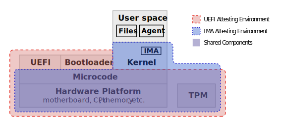

====================
Attestation Security
====================

.. role:: raw-html(raw)
  :format: html

.. |s-space| replace:: :raw-html:`
<small></small>
`

Keylime's core purpose is to verify the attested state of a system. The verification outcome (whether the attestation
is verified or not) may be used in various ways by the end user by integrating Keylime into their wider infrastructure,
for instance:

  * to produce alerts if an unauthorised change occurs somewhere in a user's fleet of machines (e.g., boot order is
    so configured that a server boots from an external drive);
    |s-space|

  * to authenticate a workload based on the state of the workload and the node on which it is running, in service of
    zero-trust principles; or
    |s-space|

  * to release keys from a key broker to unlock an encrypted data store once the data store system has been verified.
    |s-space|

As a result, a user must have faith that the verification outcome reported by Keylime is correct for the specific system
in question. It is crucial therefore to understand the security architecture and characteristics of Keylime and
attestation technologies broadly, especially as the security of an attestation service (whether Keylime or another
verification engine) depends heavily on the particular deployment.

.. note::
    At the time of this writing, Keylime only supports TPM-based attestation of `boot state`_ as recorded in UEFI logs,
    of `file system integrity`_ as recorded in Linux IMA logs, and of a TPM's `platform configuration registers (PCRs)`_
    directly. As Keylime may support other forms of attestation in the future, e.g., attestations produced by various
    trusted execution environments (TEEs), this page attempts to be agnostic as to the attestation technology being
    used in so far as is possible but does use UEFI and IMA attestation as concrete examples by which to illustrate the
    general concepts.

.. _boot state: ../user_guide/use_measured_boot.html
.. _file system integrity: ../user_guide/runtime_ima.html
.. _platform configuration registers (PCRs): ../user_guide/user_selected_pcr_monitoring.html

Attestation Terminology
-----------------------

At a high level, an attested node consists of a number of |attesting environments|_ which each consist of a stack of
software and hardware. These collect *claims* about the state of the attested node (claims are also
called *measurements*) and produce *evidence* that these claims may be believable (a collection of evidence, including
claims, is what is usually referred to as an *attestation*). The evidence is authenticated cryptographically such that
it can be verified to have been produced, at least in part, by a specific component.

An attesting environment can be further split into a *measuring environment* and a *certifying environment* [1]_. The
measuring environment collects claims/measurements and the certifying environment acts as a witness, certifying that it
has seen the claims/measurements. For example, during boot with `UEFI`_, the firmware produces a log of events which are
measured into the TPM. Later, the TPM may be asked to certify the sequence of events which it received (this
certification is also known as a *quote*). In this situation, the measuring environment consists of UEFI and the
hardware platform it is running on, and the certifying environment is the TPM.

In some cases, the measuring environment and certifying environment could be the same. When attesting certain trusted
execution environments (TEEs), for example, the TEE hardware may perform both the measuring and certifying tasks.

It is important to note that attesting environments are not required to be entirely separate from one another and, in
fact, often share components. This is illustrated by the diagram below showing UEFI and `IMA`_ attestation being
performed on the same node:

    UEFI firmware and bootloader are unique to the UEFI attesting environment while the Linux kernel is unique to the
    IMA attesting environment. But the same processor microcode, hardware platform (motherboard, CPU, memory, etc.) and TPM
    are shared by both.

  **Figure 1:** Overlapping Attesting Environments

The red shaded area shows the attesting environment which attests the boot state, whereas the blue shaded area shows the
attesting environment used to attest the integrity of files using IMA. The overlapping purple area contains the
components common to both. In both attesting environments, the certifying environment is the TPM.

.. _UEFI: https://en.wikipedia.org/wiki/UEFI
.. _IMA: https://www.redhat.com/en/blog/how-use-linux-kernels-integrity-measurement-architecture
.. _section 3.1: https://datatracker.ietf.org/doc/html/rfc9334#section-3.1
.. _attesting environments: https://datatracker.ietf.org/doc/html/rfc9334#section-3.1
.. |attesting environments| replace:: *attesting environments*

Trust Relationships
-------------------

The trust that a user chooses to place in the verification results produced by a deployment of Keylime should derive
from their trust in specific system components (*trust anchors*) and the cryptographic means by which this trust is
apportioned to other components and data. This is dependent on the secure design of the hardware, firmware and software
which produces the attestation evidence (collectively, the *attesting environment*), the secure design of Keylime and
any extensions or integrations, and the configuration of the system by the user.

As such, contributors to the Keylime project and users of Keylime alike need to consider the resulting *chain of trust*
when these units are composed together. To demonstrate this concept, a possible deployment is given in the below figure:

.. figure:: ../assets/trust-chain-diagram.svg
  :width: 721
  :align: center
  :alt: Diagram showing the various components used to produce an attestation in a given Keylime deployment. The
    baseboard management controller (BMC) loads the processor microcode and UEFI firmware. The firmware measures the
    bootloader which in turn measures the kernel. As such, the trusted hardware is used to establish trust in the
    software components which produce the attestation.

  **Figure 2:** Example Keylime Deployment Performing UEFI and IMA Verification

In this example, the user has installed the Keylime agent on a physical node which identifies itself to an instance of
the Keylime registrar and delivers evidence to a separate Keylime verifier instance. As in the diagram from the previous 
section, the node is able to attest the contents of its UEFI boot log and the integrity of specific files using Linux
IMA. The user has configured the verifier with a certain *verification policy* [2]_ which it will use to evaluate the
evidence received in each periodic attestation.

Trust in the Measuring Environment
""""""""""""""""""""""""""""""""""

When the attested node boots, the UEFI firmware and the bootloader each have their turn to execute in the boot sequence.
They both write entries to the boot log and, for each log entry, update registers in the TPM with a hash of that entry.
Nothing in the operation of the TPM ensures that the log entries **accurately** describe the events which took place at
boot time,[3]_ so the firmware and bootloader must be trusted to be honest when writing to the log.

Like any software component, the firmware and bootloader are subject to modification by legitimate users (e.g., when
performing an update) and malicious parties. But because the node in question has a Baseboard Management Controller
(BMC) which acts as an additional *hardware root of trust* together with the TPM, the user has a strong assurance that
only the correct, authenticated firmware is loaded into memory. Additionally, assuming Secure Boot is enabled, UEFI will
only launch the bootloader if it is correctly signed by an authorised OS vendor.

.. warning::
    In physical systems, the low-level software, such as the processor microcode and UEFI firmware, is loaded into
    memory by a trusted component like a BMC. In contrast, **virtualised systems** running on multi-tenant hypervisors
    and hardware, such as a virtual machine (VM) running in a public cloud (like AWS or Azure), do not have typically
    have an equivalent hardware root of trust. Your *trusted computing base* is effectively the cloud service provider's
    (CSP's) entire infrastructure.

    See :ref:`Virtual TPMs and the Root of Trust` below for considerations when operating in such an environment.

.. note::
    The BMC may also perform authentication of certain hardware components, but this depends on the platform. We are
    therefore treating the entire hardware platform as a trust anchor in this example. As hardware manufacturers adopt
    `SPDM`_, hardware authentication is expected to become more commonplace.

.. _SPDM: https://www.dmtf.org/standards/spdm

The environment which produces the boot log is therefore trusted transitively: log entries are generated by an
authorised firmware and bootloader. The bootloader is trusted because the firmware which authenticates it is trusted.
And the firmware is trusted because the BMC which loads it into memory is trusted. 

The environment which produces file integrity logs is trusted in similar fashion. As IMA generates the logs, and IMA is
part of the Linux kernel, it is authenticated by the bootloader before executing.

In both cases, trust in every component of the measuring environment can be established by tracing it to one or more
trust anchors. Therefore, the measuring environment as a whole can be trusted.[4]_

Trust in the Certifying Environment
"""""""""""""""""""""""""""""""""""

Even if we trust the measuring environment which produces the claims contained in UEFI and IMA logs, this alone is not
enough to trust the logs themselves. This is because other components of the attested node outside the measuring
environment could tamper with the logs, changing their contents before they arrive at the verifier.

As such, the measuring environment must be combined with a trusted certifying environment. In our example (and in the
usual case), such an environment is made available by the TPM.

The TPM receives each log entry as it is written and uses this to calculate a digest (or hash) with a cryptographic
one-way hash function. The input to the hash function is the log entry concatenated to any previous digest held in the 
TPM register assigned to that log. The output of the function is then used to overwrite the register's present contents.
This is known as an *extend* operation.

As this *rolling hash* is deterministically calculated from each entry in sequence, it represents the entire history of
the log from the time the system boots. If a previous entry were to change after originally being written to the log,
the log would no longer match the TPM hash. The TPM does not allow the register containing the hash to be modified in
any way other than by extending the rolling hash or by rebooting the system (which clears the TPM's registers).

.. warning::
    The TPM does not authenticate the component from which it receives log entries. This means that any program on the
    system can append to the end of the log and the log would still match the rolling hash. This is of limited use to
    an attacker which wishes modify the boot log, as boot events appearing after the boot sequence has been logged as
    having finished would not make sense.

    In the case of IMA, this characteristic of the TPM means that an attacker could append its own events to the IMA
    log and it would not be possible to differentiate these from legitimate events produced by IMA itself. This should
    not matter for conventional uses where IMA is used to detect unauthorised file modifications. The operation of
    IMA guarantees that its measurement of a file at time of access is logged and used to extend the appropriate TPM
    register. The IMA log, however, cannot be used as a guarantee of the current state of a file.

Finally, when the logs are collected by the Keylime agent and sent to the verifier, the agent asks the TPM to certify
one or more of its rolling hashes. The TPM signs the hashes with a private key known only by the TPM. The resulting
*quote* is received by the verifier which can verify its authenticity against its knowledge of the TPM's public key.
Then, the logs can be verified against the rolling hash.

In other words, the verifier can trust the received logs to contain the entries produced by one or more trusted
measuring environments because the logs match against the rolling hash. The hash can be trusted because it can be
confirmed from the signature to have been produced by a TPM which we trust to operate according to the TPM spec.

.. warning::
    Physical TPMs are `certified`_ against the TPM specification and can be verified against a manufacturer certificate
    to establish authenticity. There is no certification programme for virtual TPMs (vTPM). Because of this, in a cloud
    environment, you typically have no assurance beyond the cloud service provider's (CSP's) word that the vTPM's
    behaviour is to spec.

    See :ref:`Virtual TPMs and the Root of Trust` below for considerations when operating in such an environment.

.. _certified: https://trustedcomputinggroup.org/membership/certification/tpm-certified-products/

Chaining Trust Across Attesting Environments
""""""""""""""""""""""""""""""""""""""""""""

In the previous example, a chain of trust is formed in large part by virtue of Secure Boot, a UEFI feature which
authenticates each component in the boot sequence. However, Secure Boot is imperfect. A motivated attacker can replace
the bootloader of a system with an old, vulnerable version which is accepted by the UEFI firmware as legitimate
because it has been signed by an authorised OS vendor. This type of attack has succeeded in the past and has proved
difficult to remediate,[5]_ as signing keys cannot be easily revoked without breaking many systems, preventing them from
booting.

Instead of relying on Secure Boot, it is better to authenticate the boot chain as part of your verification policy. This
is possible because UEFI outputs the hash of the bootloader to the boot log when it loads it into memory. Your policy
can check this against a set of *reference values* of legitimate, up-to-date bootloaders.

.. note::
    The behaviour of UEFI when it loads the bootloader, including what logs are produced, is described in section 7 of
    the `TCG PC Client Platform Firmware Profile Specification`_. You should verify the hash of every EFI application
    launched as part of the boot process to establish a complete chain of trust.

.. _TCG PC Client Platform Firmware Profile Specification: https://trustedcomputinggroup.org/resource/pc-client-specific-platform-firmware-profile-specification/

The bootloader, in similar fashion, measures the kernel to the boot log before passing control to the OS. As a result,
it is possible to authenticate the kernel in your verification policy also.

From a security analysis perspective, it is important to grasp the following concept: the trust placed in an
attesting environment may be **conditional** on a verification outcome of an attestation produced by another attesting
environment. The attesting environment which produces a node's IMA log, for instance, may be trusted only if the
attesting environment which produces the UEFI log containing the hash of the kernel is trusted.

Virtual TPMs and the Root of Trust
----------------------------------

All our examples up to now have used a hardware certifying environment in the form of a TPM which is part of the
hardware platform of the attested node. However, Keylime can perform TPM-based attestation using any TPM-like device,
physical or virtual, which implements the `TPM 2.0`_ standard. In the ideal scenario, whatever TPM is used should have a
chain of trust which is rooted in hardware.[6]_

That said, there are situations in which only a TPM implemented in, and secured by, software is available. Such a
virtual TPM (vTPM) needs to be located on a trusted system. For example, when attesting a VM running in a cloud
environment, you may choose to trust a vTPM provided by your cloud service provider (CSP) and running as part of the
hypervisor.

.. note::
    Keylime was originally developed to attest VMs using the deep quotes provided by `vTPM support in Xen`_, for which
    the root of trust was a hardware TPM. However, support beyond `TPM 1.2`_ was never implemented. The vTPMs provided
    by most hypervisors today no longer have a chain of trust rooted in hardware.

.. _vTPM support in Xen: https://xenbits.xenproject.org/docs/unstable/man/xen-vtpm.7.html
.. _TPM 1.2: https://trustedcomputinggroup.org/resource/tpm-main-specification/
.. _TPM 2.0: https://trustedcomputinggroup.org/resource/tpm-lib

In such case, you should still use whatever mechanism is provided by your CSP to authenticate the vTPM. For example,
Google Cloud `allows you`_ to obtain the vTPM's endorsement key for a given VM from an HTTPS endpoint. Failure to do so
would allow an attacker to swap quotes produced by your trusted vTPM with quotes produced by its own malicious vTPM.

.. _allows you: https://cloud.google.com/compute/shielded-vm/docs/retrieving-endorsement-key#retrieving_endorsement_keys_using_the

Anchoring Trust in a Trusted Execution Environment (TEE)
""""""""""""""""""""""""""""""""""""""""""""""""""""""""

.. note::
    Keylime does not currently have specific support for TEEs. This section may be used as a guide for implementers of
    such functionality (whether within Keylime itself or as a third-party extension) and serves as additional discussion
    on trust anchors broadly.

In a confidential computing scenario, a vTPM may be running in a trusted execution environment (TEE) which has been
attested and verified to be secure by virtue of the memory-protection guarantees granted by the CPU. In such case, the
CPU would act as a hardware trust anchor. Trust in the software certifying environment provided by the vTPM would be
established transitively in the manner described in the previous section: the CPU attests the state of the TEE and
this attestation establishes trust in the vTPM.

Establishing trust in the measuring environment works similarly: for example, the instance of UEFI firmware running in
a given TEE can be authenticated by checking an attestation produced by the CPU. Additionally, the attestation which
authenticates a given measuring environment should be the same attestation which authenticates the certifying
environment (the vTPM). This serves to bind the two environments and establish a unified attesting environment (in
physical systems, this binding is established implicitly by the fact that hardware which loads the UEFI firmware, e.g.,
is physically connected to the TPM).

Additionally, because TEEs can be created on the fly, you may not be able to assume that only a single instance of a
given vTPM exists, as you can with a physical TPM. Care must therefore be taken to bind each quote produced by a
vTPM to its specific VM instance. Otherwise, a malicious hypervisor could clone a VM (including its vTPM) and interleave
messages so that the verifier thinks quotes produced by one vTPM are produced by another.

.. warning::
    While confidential computing technologies are still in their infancy, most CSPs have chosen to sacrifice security
    for simplicity. The result in many cases is that you are still required to trust the CSP's hypervisor or some other
    proprietary CSP component, beyond just the CPU. For instance, the security of Azure's `OpenHCL`_ paravisor 
    (including its vTPM) depends on a Hyper-V feature called "Virtual Secure Mode".

.. _OpenHCL: https://techcommunity.microsoft.com/t5/windows-os-platform-blog/openhcl-evolving-azure-s-virtualization-model/ba-p/4248345

Platform Identity
-----------------

Fundamentally, the job of a verifier is to accept evidence from nodes on a network and apply the appropriate
verification policy to produce a verification outcome for each node. As different nodes may have different policies, it
is important that the verifier is able to reliably identify and authenticate the underlying platform. Otherwise, an
attacker could cause the wrong verification policy to be applied to a node.

Depending on the specific deployment, this could have the affect of causing verification of a node to succeed when it
should have failed. Or, alternatively, causing verification to fail when it should have succeeded, giving rise to a
denial of service (DoS) scenario.

Whatever key is used to sign an attestation therefore needs to be bound to the individual node in question. Further,
that binding needs to be performed by a trusted entity. The binding may be transitive so that the attestation signing
key is bound to another key which itself is bound to the attested node.

In Keylime, attestations can be bound to the attested node in a number of different ways:

Binding to a TPM Endorsement Key
""""""""""""""""""""""""""""""""

Attestations produced by a TPM are authenticated by an attestation key (AK) which is typically cryptographically bound
to the TPM's endorsement key (EK). The authenticity of the EK can be determined by an EK certificate which is usually
loaded into the TPM's non-volatile memory by the TPM manufacturer.

While the EK is required to be unique to the specific TPM, it is not linked to any identifying information about the
device in which the TPM is installed (the EK certificate does not contain any such information). This is an intentional
design choice by the Trusted Computing Group (TCG) which produces the TPM standard.

.. note::
    The TPM 2.0 spec says that **a binding must be established** between the TPM and the platform before you can trust a
    TPM quote, but does not provide a built-in way to do so. This is covered in `part 1, section 9.4.3.3`_ of the
    specification.

.. _part 1, section 9.4.3.3: https://trustedcomputinggroup.org/wp-content/uploads/TPM-Rev-2.0-Part-1-Architecture-01.07-2014-03-13.pdf#%5B%7B%22num%22%3A466%2C%22gen%22%3A0%7D%2C%7B%22name%22%3A%22XYZ%22%7D%2C70%2C698%2C0%5D

When the Keylime agent first starts on the node to be attested, by default, it registers its EK, EK certificate and an
attestation key (AK), bound to the EK, with the registrar using an agent ID randomly generated by the agent or
provided by the user. The user can then use the Keylime tenant or REST API to retrieve these from the registrar, using
the agent ID, and enrol the AK with the verifier. Neither the registrar, the tenant, nor the verifier attempt to verify
the identity of the node by default.

.. note::
    Notice in the previous diagram (Figure 2) that there is no chain of trust from a trust anchor to the Keylime agent.
    This means that the Keylime agent cannot be trusted to report the correct agent ID to the registrar.

If the user wishes to rely solely on the EK as identity for the attested node, they are expected to manually verify the
EK out of band themselves **before** enrolling the node for verification. This can be done `using tpm2-tools`_.

.. _using tpm2-tools: https://github.com/tpm2-software/tpm2-tools/blob/master/man/tpm2_getekcertificate.1.md

Other Identity Binding Options
""""""""""""""""""""""""""""""

There are other ways of binding attestations produced by Keylime to a specific node. These may be more involved but are
less fragile and therefore may be better from an operations perspective:

  * If the node in question has been issued a Device Identity (DevID) by its manufacturer, the AK can be bound directly
    to this identity which itself is bound to the EK by the device manufacturer. The user simply needs to provide its
    IDevID and IAK certificates, which contain the serial number of the device or other user-facing identifying
    information, and the manufacturer's CA certificates. See the :doc:`/user_guide/idevid_and_iak` page.
    |s-space|

  * The user may construct an inventory database mapping node identifiers chosen by the user (e.g., hostnames) to an AK
    or EK. This database can be consulted before a node is added to the verifier by mechanisms available in Keylime.[6]_
    |s-space|

  * The user may set up their own automatic process to verify possession of an AK or EK as well as the identity of the
    node through a protocol like ACME or other procedure and add the node to the verifier only if these checks pass.
    This would need to be implemented as an unofficial extension to Keylime.
    |s-space|

Threat Model
------------

In the design of a secure system, it is prudent to define a threat model in terms of the capabilities of an idealised
attacker. This has a number of advantages, not limited to the following:

  * users are clear on the security properties they can expect from the system;
    |s-space|

  * developers have agreement on which attacks are in scope and which are out of scope; and
    |s-space|

  * the protocols utilised naturally lend themselves to analysis by outside parties.
    |s-space|

In lieu of a full formal model, we give a plain English description, translatable to formal definitions, in the
subsections below.

Security Goals
""""""""""""""

We give the main security property for Keylime by stating what a successful adversary must achieve:

    **A valid attack against Keylime is one in which an adversary can cause a mismatch between a verification outcome
    reported by a verifier and the correct, expected verification outcome for the verified node.**

This includes attacks in which:

  * verification of a node is reported as having passed when the policy for the node should have resulted in a
    verification failure; or
    |s-space|

  * verification of a node is reported as having failed when the policy for the node should have resulted in a
    successful verification.
    |s-space|

The latter is important to consider because, depending on how Keylime is used (e.g., if Keylime results are consumed by
another system or used for authentication of non-person entities), this could be exploited to trigger cascading failures
throughout the network.

The Capabilities of the Adversary
"""""""""""""""""""""""""""""""""

For our adversary, we consider a typical network-based (Dolev-Yao) attacker [7]_ which exercises full control over the
network and can intercept, block and modify all messages but cannot break cryptographic primitives (all cryptography is
assumed perfect). Because we need to consider attacks in which the adversary is resident on a node to be verified, we
extend the "network" to include channels between the agent and any attesting environment (for TPM-based attestation,
this includes communication between the TPM and the agent).

The adversary cannot corrupt (i.e., take control of, or impersonate) the verifier, registrar, tenant or any attesting
environment, but has full control over the rest of the system, including the nodes' filesystem and memory.

Exclusions
""""""""""

Attacks which exploit poorly-defined verification policies or deficiencies in the information which can be obtained from
a node's attesting environments (including IMA and UEFI logs) are necessarily out of scope. Additionally, we exclude
attacks which are made possible by incorrect configuration by the user. Attacks which rely on modification of a system
root of trust (such as the BMC or TPM) are also excluded.

:raw-html:` `

----

**Footnotes:**

.. [1] *Attesting environments*, *claims*, and *evidence* are the terms preferred by the IETF's Remote Attestation
   Procedures (RATS) working group in their architecture specification, `RFC 9334`_. Although they do not explicitly 
   divide attesting environments into a *measuring environment* and *certifying environment* as we do here, separating
   claims collection and certification of claims into separate components is contemplated in section 3.1.

.. [2] It is common for a verification policy to perform verification of evidence against a separate set of *reference
   values* or *reference measurements*. For the purposes of this page, we consider that any reference values are part of
   the verification policy itself, as the distinction should not impact security analysis.

.. [3] The function of the TPM here is to provide assurance that the UEFI log file made available to the Keylime agent
   through the OS contains the same log entries that were produced at boot time and thus have not been tampered with by
   something other than the firmware or bootloader.
   
   This assurance comes from (1) the fact that while a TPM register only contains a hash produced for the final log
   entry in a sequence of entries, that hash is cryptographically chained to every previous hash and therefore every
   previous log entry in the sequence and (2) the registers which record the boot log hashes cannot be reset while the
   system is powered on. The mechanism by which hashes are chained is described in `part 1, section 11.4.7`_ of the TPM
   2.0 spec.

.. [4] The trust anchor in which the measuring environment's trust is rooted is called the *root of trust for
   measurement* in the TPM spec. This corresponds to the BMC in our example. Similarly, the certifying environment's
   trust anchor (the TPM) is known as the *root of trust for storage*.

.. [5] Secure Boot bypass vulnerabilities have previously been found in several instances (e.g., CVE-2020-10713 and 
   CVE-2022-21894) and have been exploited in the wild by persistent UEFI bootkits like *BlackLotus*. The UEFI shim 
   project, typically used by Linux systems, has attempted to `improve revocation`_ of vulnerable bootloaders, but
   remediation remains difficult. Addressing BlackLotus, for instance, has required `manual intervention`_.

.. [6] This is because attacks against hardware are considerably more difficult to pull off than attacks which exploit
   vulnerabilities in software. Certain hardware designs can also make a number of physical attacks impractical.

.. [7] Currently, this may be achieved by setting the ``ek_check_script`` configuration option in
   ``/etc/keylime/tenant.conf``. In the future, it will be possible to use an external service queried by the registrar
   instead (see `PR 1670`_).

.. [8] This type of rule-based adversary is first described by Danny Dolev and Andrew Yao in their 1983 paper, `"On the
   security of public key protocols"`_.

.. _RFC 9334: https://datatracker.ietf.org/doc/html/rfc9334
.. _part 1, section 11.4.7: https://trustedcomputinggroup.org/wp-content/uploads/TPM-Rev-2.0-Part-1-Architecture-01.07-2014-03-13.pdf#%5B%7B%22num%22%3A537%2C%22gen%22%3A0%7D%2C%7B%22name%22%3A%22XYZ%22%7D%2C70%2C232%2C0%5D
.. _improve revocation: https://github.com/rhboot/shim/blob/main/SBAT.md
.. _manual intervention: https://www.microsoft.com/en-us/security/blog/2023/04/11/guidance-for-investigating-attacks-using-cve-2022-21894-the-blacklotus-campaign/
.. _"PR 1670": https://github.com/keylime/keylime/pull/1670
.. _"On the security of public key protocols": http://www.cs.huji.ac.il/~dolev/pubs/dolev-yao-ieee-01056650.pdf