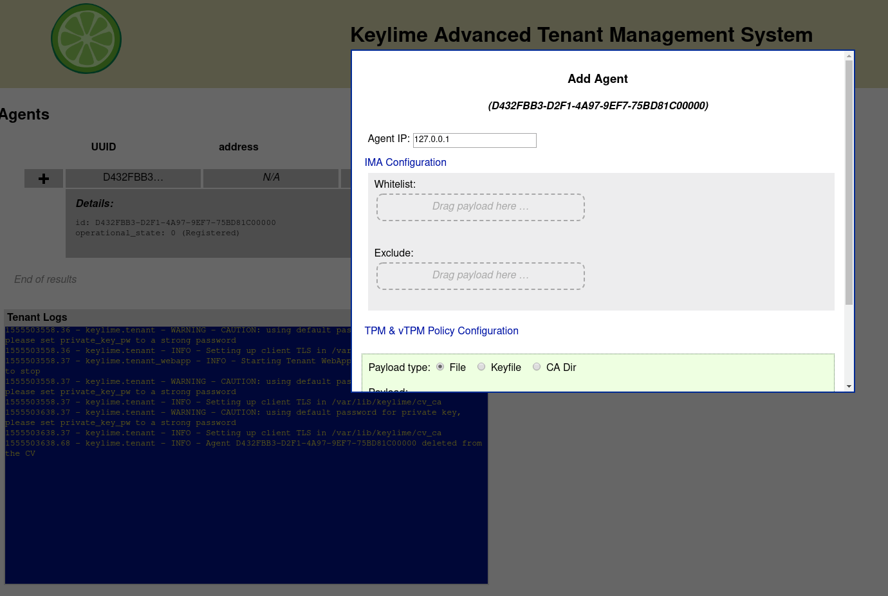

Run-time Integrity Monitoring
=============================

Keylimes run-time integrity monitoring requires the set up of Linux IMA.

You should refer to your Linux Distributions documentation to enable IMA, but
as a general guide most recent versions already have `CONFIG_IMA` toggled to
`Y` as a value during Kernel compile.

It is then just a case of deploying an `ima-policy` file. On a Fedora or Debian
system, the file is situated in `/etc/ima/ima-policy`.

For configuration of your IMA policy, please refer to the `IMA Documentation <https://github.com/torvalds/linux/blob/6f0d349d922ba44e4348a17a78ea51b7135965b1/Documentation/ABI/testing/ima_policy>`_

Within Keylime we use the following for demonstration::

  # PROC_SUPER_MAGIC
  dont_measure fsmagic=0x9fa0
  # SYSFS_MAGIC
  dont_measure fsmagic=0x62656572
  # DEBUGFS_MAGIC
  dont_measure fsmagic=0x64626720
  # TMPFS_MAGIC
  dont_measure fsmagic=0x01021994
  # RAMFS_MAGIC
  dont_measure fsmagic=0x858458f6
  # SECURITYFS_MAGIC
  dont_measure fsmagic=0x73636673
  # MEASUREMENTS
  measure func=BPRM_CHECK
  measure func=FILE_MMAP mask=MAY_EXEC
  measure func=MODULE_CHECK uid=0

This default policy measures all executables in `bprm_check`, all files `mmapped`
executable in `file_mmap` and module checks.

Once your `ima-policy` is in place, reboot your machine (or even better have it
present in your image for first boot).

You can then verify IMA is measuring your system::

  # head -5 /sys/kernel/security/ima/ascii_runtime_measurements
  PCR                                  template-hash filedata-hash                                 filename-hint
  10 3c93cea361cd6892bc8b9e3458e22ce60ef2e632 ima-ng sha1:ac7dd11bf0e3bec9a7eb2c01e495072962fb9dfa boot_aggregate
  10 3d1452eb1fcbe51ad137f3fc21d3cf4a7c2e625b ima-ng sha1:a212d835ca43d7deedd4ee806898e77eab53dafa /usr/lib/systemd/systemd
  10 e213099a2bf6d88333446c5da617e327696f9eb4 ima-ng sha1:6da34b1b7d2ca0d5ca19e68119c262556a15171d /usr/lib64/ld-2.28.so
  10 7efd8e2a3da367f2de74b26b84f20b37c692b9f9 ima-ng sha1:af78ea0b455f654e9237e2086971f367b6bebc5f /usr/lib/systemd/libsystemd-shared-239.so
  10 784fbf69b54c99d4ae82c0be5fca365a8272414e ima-ng sha1:b0c601bf82d32ff9afa34bccbb7e8f052c48d64e /etc/ld.so.cache

Keylime IMA whitelists
----------------------

A whitelist is a set of "golden" cryptographic hashes of a files un-tampered
state.

The structure of the white list is a hash followed by a full POSIX path to the
file::

  ffe3ad4c395985d143bd0e45a9a1dd09aac21b91 /path/to/file

Keylime will load the whitelist into the Keylime Verifier. Keylime will then
poll tpm quotes to `PCR 10` on the agents TPM and validate the agents file(s)
state against the whitelist. If the object has been tampered with, the hashes
will not match and Keylime will place the agent into a failed state. Likewise,
if any files invoke the actions stated in `ima-policy` that are not matched in
the whitelist, keylime will place the agent into a failed state.

Generate a whitelist
~~~~~~~~~~~~~~~~~~~~

Keylime provides a script to generate whitelists from `initramfs`, but this is
only a guide. We encourage developers / users of Keylime to be creative and come
up with their own process for securely creating and maintaining a whitelist.

The `create_whitelist.sh` script is `available here <https://github.com/keylime/python-keylime/blob/master/keylime/create_whitelist.sh>`_

Run the script as follows::

  # create_whitelist.sh  whitelist.txt [hash-algo]

With `[hash-algo]` being `sha1sum`, `sha256sum` (note, you need the OpenSSL app
installed to have the shasum CLI applications available).

This will then result in `whitelist.txt` being available for Agent provisioning.

.. warning::
    It’s best practice to create the whitelist in a secure environment. Ideally,
    this should be on a fully encrypted, air gapped computer that is permanently
    isolated from the Internet. Disable all network cards and sign the whitelist
    hash to ensure no tampering occurs when transferring to other machines.

Alongside building a whitelist from `initramfs`, you could also generate good
hashes for your applications files or admin scripts that will run on the
remotely attested machine.

Excludes List
~~~~~~~~~~~~~

An excludes list can be utilised to exclude any file or path. The excludes list
supports standard regular expressions, for example the `tmp` directory can be
ignored::

  /tmp/*

Remotely Provision Agents
~~~~~~~~~~~~~~~~~~~~~~~~~

Now that we have our whitelist available, we can send it to the verifier.

.. note::
  If you're using a TPM Emulator (for example with the ansible-keylime-tpm-emulator, you will also need
  to run the keylime ima emulator. To do this, open a terminal and run `keylime_ima_emulator`

Using the `keylime_tenant` we can send the whitelist and our excludes list as
follows::

  keylime_tenant -v <verifier-ip> -t <agent-ip> -f /path/excludes.txt --uuid D432FBB3-D2F1-4A97-9EF7-75BD81C00000 --whitelist /path/whitelist.txt --exclude /path/excludes.txt

.. note::
  If your agent is already registered, you can use `-c update`

Should you prefer, you can set the values `ima_whitelist` & `ima_excludelist`
within `/etc/keylime.conf`, you can then use `default` as follows::

  `keylime_tenant -v 127.0.0.1 -t neptune -f /root/excludes.txt --uuid D432FBB3-D2F1-4A97-9EF7-75BD81C00000 --whitelist default --exclude default`

The whitelist can also be uploaded using the WebApp:

How can I test this?
--------------------

Create a script that does anything (for example `echo "hello world"`) that is not
present in your whitelist or the excludes list. Run the script as root on the
agent machine. You will then see the following output on the verifier showing
the agent status change to failed::

  keylime.tpm - INFO - Checking IMA measurement list...
  keylime.ima - WARNING - File not found in whitelist: /root/evil_script.sh
  keylime.ima - ERROR - IMA ERRORS: template-hash 0 fnf 1 hash 0 good 781
  keylime.cloudverifier - WARNING - agent D432FBB3-D2F1-4A97-9EF7-75BD81C00000 failed, stopping polling
